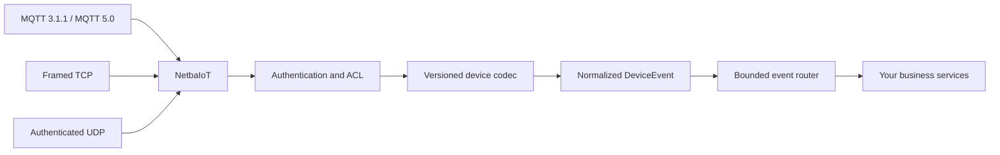

# NetbaIoT

**An IoT gateway that stays a gateway.**

NetbaIoT is a database-free, memory-first IoT ingress gateway and real-time event
router written in Rust. Devices connect over MQTT 3.1.1, MQTT 5.0, framed TCP, or
authenticated UDP. NetbaIoT validates and normalizes uplinks into `DeviceEvent`s,
then routes them to your business services.

**MQTT 3.1.1 / MQTT 5.0 / framed TCP / authenticated UDP in → `DeviceEvent` out.**
Your business data stays in your backend.

[](https://github.com/sskycn/netbaiot/actions/workflows/ci.yml)
[](LICENSE)
[](https://github.com/sskycn/netbaiot/releases)
[](Cargo.toml)

**Quick links:** [5-minute Quick Start](docs/quick-start.md) · [Architecture](docs/architecture.md) · [Protocol support](docs/protocol-support.md) · [Delivery semantics](docs/delivery-semantics.md) · [Benchmarks](docs/benchmarks.md) · [Security](docs/security.md) · [中文](README.zh-CN.md)



## Why NetbaIoT?

- **No runtime database dependency.** The gateway accepts and routes live device
  traffic without PostgreSQL, Redis, or a message store. Business systems own
  durable telemetry, workflows, analytics, and offline command intent.
- **Several device transports, one event model.** MQTT, framed TCP, and signed
  UDP uplinks use the configured versioned codec and produce the same public
  `DeviceEvent` type.
- **Acceptance has a defined boundary.** A producer receipt means the required
  sink queues admitted and enqueued the event. It does not mean a business
  database committed it. See [delivery semantics](docs/delivery-semantics.md).
- **Resource use is bounded.** Connection, packet, cache, event, queue, sink,
  command, subscription, replay, and recovery state have count and byte limits.
- **Planned restart recovery is explicit.** A graceful shutdown drains required
  work or commits pending work to the local recovery spool. This is not crash
  durability; abrupt failures can lose recent in-memory work.

## Quick Start

From a source checkout (Rust 1.88+):

```bash
cargo run --locked -p netbaiot-cli -- demo
```

From an extracted binary archive:

```bash
./netbaiot demo
# Run one end-to-end sample, then stop:
./netbaiot demo --once
```

On Windows, use `.\netbaiot.exe demo` in PowerShell. The Rust-only demo binds
loopback on dynamic ports, authenticates the sample MQTT device, publishes a
heartbeat, waits for the business sink ACK, and prints a standard `mosquitto_pub`
command with the actual port. Python and Mosquitto are optional for this first
experience. Press Ctrl-C to drain and remove the private temporary recovery files.
The printed device credentials are for local development only.

NetbaIoT implements its own MQTT broker. Ordinary MQTT clients remain first-class;
use the demo's printed command, or follow the [manual MQTT example](docs/quick-start.md#manual-mqtt-example)
with `mosquitto_pub -V mqttv311` (or `-V mqttv5`).

Check and run your own JSON configuration:

```bash
./netbaiot config check --config configs/tutorial.json
./netbaiot serve --config configs/tutorial.json
```

The tutorial config needs its manual webhook; use `configs/development.json` for
ingress with the in-process development audit sink. See [CLI commands](docs/cli.md),
[Quick Start](docs/quick-start.md), and [production operations](docs/operations-guide.md).

Create your own local project with `netbaiot init my-gateway`, then run
`netbaiot config check --config netbaiot.json` and `netbaiot doctor --config netbaiot.json`
from its directory. [Configuration/IDE support](docs/configuration.md),
[doctor](docs/doctor.md), and [maintenance](docs/maintenance.md) describe the full flow.

## How it works

```text
Devices → transport and authentication → versioned codec → DeviceEvent
        → bounded EventBus → business webhook or confirmed TCP/RPC consumer
```

The public Rust `DeviceEvent` type contains a `DeviceKey` and a tagged event
kind. The built-in HTTP webhook maps it to this business envelope, which is what
the Quick Start receiver prints:

```json
{
  "event_id": "2b13d944-bb18-40df-8043-a636807fc023",
  "source_message_id": "demo:1",
  "tenant_id": "demo",
  "product_id": "sensor",
  "device_id": "device-1",
  "event_type": "heartbeat",
  "received_at": 1791203077827,
  "occurred_at": null,
  "payload": { "kind": "heartbeat", "data": { "sequence": 1 } }
}
```

`event_id` is assigned by the gateway and stays stable across retries and
planned-restart replay. Consumers should persist it with their business update
and deduplicate it. Your backend can store or forward the event using the systems
you already operate; NetbaIoT does not require a particular database or queue.

## When should I use NetbaIoT?

NetbaIoT may fit when you already own a business backend, need MQTT/TCP/UDP
device ingress, want protocol-specific uplinks normalized to one event type, and
want durable business state and offline workflows to remain in your application.
It is also a fit when bounded queues and visible acceptance/failure semantics are
important design constraints.

## When should I not use NetbaIoT?

Choose a different component or pair NetbaIoT with one if your requirement is a
complete IoT cloud product with built-in dashboards, time-series storage, device
OTA, or a rule-engine UI; a clustered or high-availability MQTT service; MQTT
over WebSocket, shared subscriptions, MQTT-SN, or bridge mode; or crash-durable
message storage. Those are not provided by this gateway.

## Supported protocols

| Ingress | Current profile |
| --- | --- |
| MQTT | Embedded MQTT 3.1.1 and MQTT 5.0 broker; QoS 0/1/2, retained messages, Will, bounded persistent sessions, and exact/`+`/`#` subscriptions |
| TCP | Length-prefixed generic frames and MQTT share the device TCP listener; non-loopback TCP requires TLS |
| UDP | NBI1 uplink with HMAC authentication, timestamp checks, replay protection, and signed NBA1 acceptance receipt; no encryption or downlink |
| Business egress | Confirmed HTTP webhook or framed TCP/RPC consumer; independent bounded queues and ACK rules |

See the [protocol support matrix](docs/protocol-support.md) and detailed
[MQTT profile](docs/mqtt.md). UDP authentication does not provide confidentiality:
**authenticated is not encrypted**.

## Commands and reliability

Commands are sent only to a currently connected local MQTT/TCP session. An offline
device returns unavailable; the gateway does not queue commands for later.
Transport write, device receipt, and device execution are separate states.
Execution acknowledgements return as ordinary `DeviceEvent`s. The business
application owns durable command intent and retry policy.

Required sink fanout is admitted atomically. Required sinks acknowledge delivery;
best-effort sinks follow their bounded drop policy. Delivery is at-least-once, so
retries and recovery can repeat an event. MQTT PUBACK means `EventAccepted`, not
business database commit. See [delivery semantics](docs/delivery-semantics.md),
[reliability](docs/reliability.md), and [restart recovery](docs/restart-spool.md).

## Security

MQTT and TCP authenticate a connection and bind its device identity. Non-loopback
device TCP requires TLS. Management HTTP has a separate authorization boundary;
device credentials do not authorize management operations. UDP uses HMAC and replay
checks, but does not encrypt payloads. Secrets must be injected through protected
configuration/environment and must not be logged. Read the [security overview](docs/security.md)
and [operations guide](docs/operations-guide.md) before deployment. Report undisclosed
vulnerabilities through the [Security Policy](SECURITY.md).

## Benchmarks

The repository contains measured loopback and subsystem experiments, with host,
build, load, and caveats in the reports. Several results are historical and do not
establish capacity for the current revision or a production deployment. The
[benchmark overview](docs/benchmarks.md) explains what the numbers do and do not
show; the detailed [performance baseline](docs/performance-baseline.md) preserves
the original measurements and setup.

## Current limitations

- NetbaIoT is a single-node gateway. Shared live sessions and command routing
  across nodes and clustered high availability are not implemented.
- HTTP is not a device ingress protocol. The HTTP listener is for management and
  is separate from device connections.
- There is no built-in dashboard, durable business database, offline command
  store, device configuration reconciler, OTA system, or rule-engine UI.
- MQTT over WebSocket, MQTT-SN, shared subscriptions, broker bridge mode, and
  `$SYS` services are outside the supported MQTT profile.
- UDP is authenticated but unencrypted and sessionless; it has no command
  downlink.
- Recovery is for successful planned graceful shutdowns. It is not a general
  database and does not make arbitrary process or machine crashes durable.
- The workspace is version `0.2.3` and has not reached 1.0. Review protocol and
  migration notes before upgrading; do not assume every API is stable.

## Documentation

- [5-minute Quick Start](docs/quick-start.md) · [10-minute end-to-end tutorial](docs/getting-started.md)
- [Design philosophy](docs/design-philosophy.md) · [How NetbaIoT compares by intended role](docs/comparison.md)
- [Protocol support](docs/protocol-support.md) · [MQTT 3.1.1/5.0 profile](docs/mqtt.md) · [Device wire format](docs/device-protocol.md)
- [Delivery semantics](docs/delivery-semantics.md) · [Reliability](docs/reliability.md) · [Restart spool](docs/restart-spool.md)
- [Security](docs/security.md) · [Operations](docs/operations-guide.md) · [Troubleshooting](docs/troubleshooting.md)
- [Business integration and clients](docs/business-integration-guide.md) · [CLI](docs/cli.md) · [Device SDK](docs/device-sdk.md)
- [Benchmark overview](docs/benchmarks.md) · [Performance baseline](docs/performance-baseline.md)
- [v0.2.3 release notes](docs/releases/v0.2.3.md) · [Release notes template](docs/release-template.md) · [Project descriptions and launch drafts](docs/project-description.md)

## Build and release

Build from source with the workspace's minimum supported Rust toolchain:

```bash
cargo +1.88.0 build --locked
```

Tagged releases are built by GitHub Actions for Linux, macOS, and Windows; see
[Releases](https://github.com/sskycn/netbaiot/releases). There is no official
Docker image in this repository. The command-line client is `netbaiot`; see the
[CLI guide](docs/cli.md).

## Contributing

Start with [CONTRIBUTING.md](CONTRIBUTING.md) for setup and required checks.
Read [AGENTS.md](AGENTS.md) for the architecture and correctness constraints.
Bug reports and focused pull requests are welcome. Changes to public protocol or
MQTT behavior should include compatibility evidence and focused tests.

## License

NetbaIoT is licensed under [AGPL-3.0-or-later](LICENSE).
