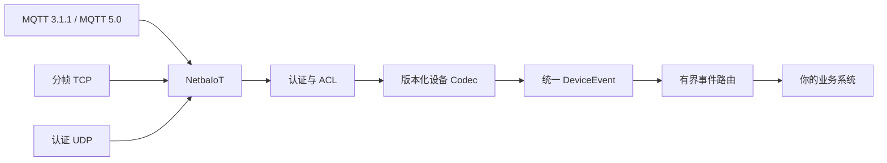

# NetbaIoT

[English](README.md)

**一个保持网关边界的 IoT 网关。**

NetbaIoT 是使用 Rust 编写、无需运行时数据库、以内存为主的 IoT 设备接入
网关与实时事件路由器。设备通过 MQTT 3.1.1、MQTT 5.0、分帧 TCP 或经过认证的
UDP 接入。网关验证并规范化上行数据为 `DeviceEvent`，再路由给业务服务。

**MQTT 3.1.1 / MQTT 5.0 / 分帧 TCP / 认证 UDP 进入 → `DeviceEvent` 输出。**
业务数据仍由你的后端负责。

[](https://github.com/sskycn/netbaiot/actions/workflows/ci.yml)
[](LICENSE)
[](Cargo.toml)

**快速入口：**[5 分钟 Quick Start](docs/quick-start.md) · [架构](docs/architecture.zh-CN.md) · [协议支持](docs/protocol-support.md) · [投递语义](docs/delivery-semantics.zh-CN.md) · [性能基线](docs/benchmarks.md) · [安全](docs/security.md)



## 为什么是 NetbaIoT？

- **运行时不依赖数据库。** 网关无需 PostgreSQL、Redis 或消息存储即可接收并
  路由设备流量。业务系统负责长期遥测、工作流、分析和离线命令意图。
- **多种设备传输，共用一种事件模型。** MQTT、分帧 TCP 和签名 UDP 上行均使用
  配置的版本化 Codec，输出相同的公开 `DeviceEvent` 类型。
- **接纳边界有明确定义。** 设备回执表示必需 Sink 队列已完成资源接纳和入队，
  不表示业务数据库已提交。详见[投递语义](docs/delivery-semantics.md)。
- **资源有界。** 连接、报文、缓存、事件、队列、Sink、命令、订阅、重放和恢复
  状态都有数量与字节上限。
- **计划重启恢复语义明确。** 优雅关机时会排空必需投递，或把未完成工作提交到本地
  recovery spool。这不是崩溃持久化；突然故障可能丢失近期内存工作。

## 快速开始

需要 Rust 1.88+、Python 3 和 Mosquitto 客户端工具（`mosquitto_pub`）。Mosquitto
仅作为客户端；NetbaIoT 自带 MQTT broker。Demo 仅监听 loopback，并使用
`configs/tutorial.json` 中的本地演示凭据，**不可用于生产**。

终端 1 启动网关和简单 webhook 接收器：

```bash
./scripts/demo/start.sh
```

看到 `runtime ready` 日志后再发布消息。

终端 2 发布一条设备事件：

```bash
mosquitto_pub -h 127.0.0.1 -p 8080 -V mqttv311 \
  -u demo-device -P 000102030405060708090a0b0c0d0e0f101112131415161718191a1b1c1d1e1f \
  -i quickstart -t v1/t/demo/p/sensor/d/device-1/up -q 1 \
  -m '{"schema_version":1,"source_message_id":"demo:1","kind":"heartbeat","data":{"sequence":1}}'
```

第一个终端会打印 webhook 收到的规范化事件。按 Ctrl-C 停止。MQTT 5.0 使用同一
监听器和 topic，将 `-V mqttv311` 改为 `-V mqttv5`。完整[Quick Start](docs/quick-start.md)
解释事件字段、开发凭据、TCP/UDP 示例和优雅停止方式。

## 工作方式

```text
设备 → 传输与认证 → 版本化 Codec → DeviceEvent
     → 有界 EventBus → 业务 webhook 或已确认的 TCP/RPC 消费端
```

公开 Rust `DeviceEvent` 类型包含 `DeviceKey` 和带标签的事件类型。内置 HTTP webhook
会将它映射为下面的业务 JSON envelope，这也是 Quick Start 接收端实际打印的结构：

```json
{
  "event_id": "2b13d944-bb18-40df-8043-a636807fc023",
  "source_message_id": "demo:1",
  "tenant_id": "demo",
  "product_id": "sensor",
  "device_id": "device-1",
  "event_type": "heartbeat",
  "received_at": 1791203077827,
  "occurred_at": null,
  "payload": { "kind": "heartbeat", "data": { "sequence": 1 } }
}
```

`event_id` 由网关生成，在重试和计划重启重放时保持稳定。业务消费端应将它与业务
更新一并持久化并据此去重。你的后端可以按现有方式保存或转发事件；NetbaIoT 不要求
使用某个特定数据库或队列。

## 适合哪些场景？

当你已有业务后端，需要 MQTT/TCP/UDP 设备接入，希望多种设备协议归一为一种事件类型，
并且希望长期业务状态与离线工作流由应用持有时，NetbaIoT 可能适合你。它也适用于把
有界队列和明确的接纳/失败语义作为设计约束的系统。

## 哪些场景不适合？

如果你需要完整 IoT 云平台（内置仪表盘、时序存储、设备 OTA 或规则引擎 UI）、集群或
高可用 MQTT 服务、MQTT over WebSocket、共享订阅、MQTT-SN、Broker bridge，或崩溃持久化
消息存储，请选择其他组件或与 NetbaIoT 组合。这些能力不是本网关提供的功能。

## 协议支持

| 接入 | 当前配置 |
| --- | --- |
| MQTT | 内嵌 MQTT 3.1.1 和 MQTT 5.0 broker；QoS 0/1/2、保留消息、Will、有界持久会话、精确/`+`/`#` 订阅 |
| TCP | 长度前缀通用帧与 MQTT 共用设备 TCP 监听器；非 loopback TCP 必须启用 TLS |
| UDP | NBI1 上行使用 HMAC 认证、时间戳检查、重放保护和签名 NBA1 接纳回执；不加密、无下行 |
| 业务出口 | 已确认 HTTP webhook 或分帧 TCP/RPC 消费端；队列和确认策略相互独立且有界 |

详见[协议支持矩阵](docs/protocol-support.md)和 [MQTT profile](docs/mqtt.md)。UDP 认证不
提供机密性：**经过认证不代表已经加密**。

## 命令与可靠性

命令只发送到当前连接的本机 MQTT/TCP 会话。设备离线时返回不可用；网关不会将命令排队
留待以后投递。传输写入、设备接收和设备执行是不同状态。执行确认作为普通
`DeviceEvent` 返回。业务应用负责持久化命令意图和重试策略。

必需 Sink 扇出采用原子接纳。必需 Sink 显式确认投递；尽力而为 Sink 按有界丢弃策略
处理。投递是 at-least-once，重试和恢复可能造成重复。MQTT PUBACK 表示 `EventAccepted`，
不表示业务数据库已提交。详见[投递语义](docs/delivery-semantics.md)、[可靠性](docs/reliability.md)
和[重启恢复](docs/restart-spool.md)。

## 安全

MQTT 和 TCP 在连接时认证并绑定设备身份。非 loopback 设备 TCP 必须使用 TLS。管理 HTTP
使用独立授权边界，设备凭据不能授权管理操作。UDP 使用 HMAC 和重放检查，但不加密载荷。
应通过受保护的配置或环境注入密钥，不要记录密钥。部署前阅读[安全概述](docs/security.md)
和[运维指南](docs/operations-guide.md)。

## 基准测试

仓库保留了 loopback 和子系统实验数据，报告包含环境、构建、负载和局限。部分结果来自
历史提交，不能证明当前版本或生产环境的容量。[基准概述](docs/benchmarks.md)解释了数据
能说明和不能说明的内容；[性能基线](docs/performance-baseline.md)保留原始测量和环境。

## 当前限制

- NetbaIoT 当前是单节点网关，尚未实现跨节点共享在线会话、命令路由或集群高可用。
- HTTP 不是设备接入协议。HTTP 监听器用于管理接口，与设备连接分离。
- 不提供内置仪表盘、业务数据库、离线命令存储、设备配置协调器、OTA 或规则引擎 UI。
- MQTT over WebSocket、MQTT-SN、共享订阅、Broker bridge 和 `$SYS` 服务不在支持范围内。
- UDP 经过认证但不加密、无会话，也不支持命令下行。
- 恢复只覆盖成功完成的计划优雅关机；它不是通用数据库，不能让任意进程或机器崩溃变得持久。
- Workspace 版本为 `0.2.2`，尚未到 1.0。升级前请阅读协议和迁移说明，不要默认所有 API 均稳定。

## 文档

- [5 分钟 Quick Start](docs/quick-start.md) · [10 分钟端到端教程](docs/getting-started.md)
- [设计理念](docs/design-philosophy.md) · [按项目定位比较](docs/comparison.md)
- [协议支持](docs/protocol-support.md) · [MQTT 3.1.1/5.0](docs/mqtt.md) · [设备报文格式](docs/device-protocol.zh-CN.md)
- [投递语义](docs/delivery-semantics.zh-CN.md) · [可靠性](docs/reliability.md) · [重启 spool](docs/restart-spool.md)
- [安全](docs/security.md) · [运维](docs/operations-guide.md) · [故障排查](docs/troubleshooting.md)
- [业务集成与客户端](docs/business-integration-guide.md) · [CLI](docs/cli.zh-CN.md) · [设备 SDK](docs/device-sdk.zh-CN.md)
- [基准概述](docs/benchmarks.md) · [性能基线](docs/performance-baseline.md)
- [发布模板](docs/release-template.md) · [项目介绍和发布草稿](docs/project-description.md)

## 构建与发布

使用 workspace 最低支持版本构建：

```bash
cargo +1.88.0 build --locked
```

GitHub Actions 会在打 tag 后为 Linux、macOS 和 Windows 构建发布包，见
[Releases](https://github.com/sskycn/netbaiot/releases)。仓库目前没有官方 Docker 镜像。
命令行客户端程序名为 `netbaiot`，详见 [CLI 指南](docs/cli.md)。

## 参与贡献

架构和正确性约束见 [AGENTS.md](AGENTS.md)。欢迎提交问题和聚焦的 Pull Request。公开协议
或 MQTT 行为改动需要兼容性证据和针对性测试。

## 许可证

NetbaIoT 使用 [AGPL-3.0-or-later](LICENSE) 许可证。
