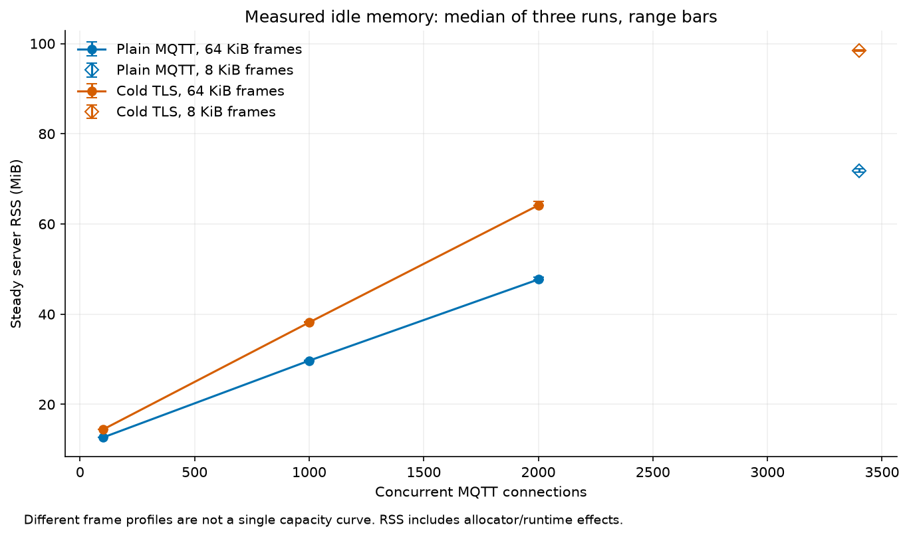
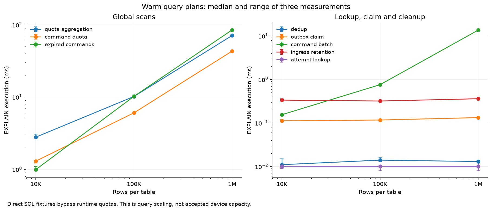
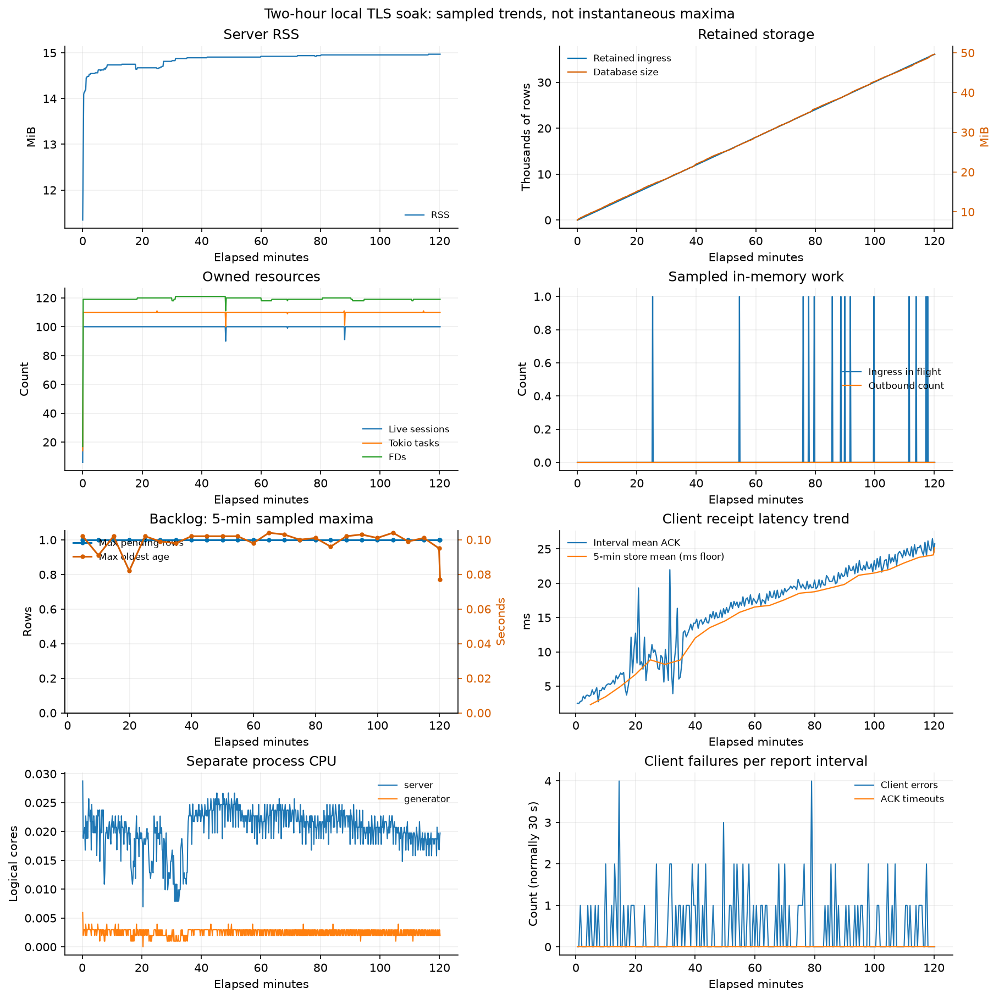

# NetbaIoT Global Capacity / Performance / Soak Audit

日期：2026-09-19。正确性基线：`053f663587632077b6c7dc1edea2a8f3f2750242`。
这是本机容量实验，不是生产容量承诺。所有网络负载均运行独立 release Rust 生成器，连接真实 listener 和真实 PostgreSQL。没有增加设备功能，没有改变投递/命令尝试语义，没有调高生产默认预算或超时，没有 push。

## Executive Summary

本机最高成功实测 **3,400 个并发 MQTT 连接**，明文/TLS 各三次零错误，使用单独的 8 KiB 帧配置。64 KiB 帧的逻辑内存预算在 2,048 连接触顶；5,000 凭据配置超过读取上限而启动拒绝。未声称测过 10K/25K/50K，也没有测到 CPU 或 allocator 硬极限。

最高三次零错误的短窗口上行点为 QoS0 **50 msg/s**（ramp 500/s）与 QoS1 durable ingress **50 msg/s**（ramp 20/s），各三次 120 s。QoS1 在 ramp 500/s 下连 10 msg/s 都未得到三次零错误，不能忽略到达形状。命令发送阶段 **10 commands/s**、各三次 60 s，每次 590 ACK。它们是有条件的有限窗口结果，不是跨保留期的生产持续容量。两小时 TLS 5 msg/s 长稳虽全部已接受消息送达，却有 114 次连接错误，区间平均 ACK 从 3.27 ms 升至 25.12 ms，因此没有证明长期零错误或延迟稳定。

最先影响服务质量的是 **protocol Admission 的瞬时拒绝**，发生在 CPU/数据库硬件饱和之前；具体全局/租户原因尚未由独立 counter 区分。后续扩展成本包括全局配额聚合与锁串行、空闲 command poll/每条命令多事务、Admission 全局扫描，以及保留行增长引起的存储调用耗时增加。慢消费者与噪声租户资源有界，但健康组尾延迟和错误不满足严格隔离保证。

全审计最大实测服务 RSS 为 **98.797 MiB**（3,400 TLS 连接断开后的 cooldown），不是 PostgreSQL 数据库体积或生成器内存。RSS 通常不回到启动值；registry/task/FD 清理和 vmmap 支持 allocator 保留页解释，尚不能证明无泄漏。生产未保留性能优化；保留可复现实验工具、低基数观测及生成器响应限长。离线到期索引有明显 query-plan 收益，但端到端/写入成本证据不足，列为 DEFER。

完整条件和失败记录见各节及 [机器可读汇总](performance/summary.json)。配置的 offered rate 不是实际接受速率，清空 outbox 不释放 24 h ingress/dedup 配额，也不保证 terminal delivery failures 已补偿。

[audit-overview.json](performance/audit-overview.json) 汇总 163 个已结束的 case 记录，包含配置拒绝、失败注入和两次人工中断；不是 163 个通过案例。`payload_q0_128` 与 `stable_q0_25_r2` 的中断原始记录均保留，不用于稳定吞吐判断。临时 PostgreSQL 已在全部实验完成后停止，数据库目录保留供复核。

## Test Environment

[environment.json](performance/environment.json)：Apple M4，10 个逻辑 CPU，16 GiB RAM，macOS 26.6.2 arm64；Rust 1.97.1，PostgreSQL 17.11。服务、生成器、Python HTTP sink、数据库均在同一主机，使用 IPv4 loopback。不能把本机低 RTT 外推至远程数据库、真实无线链路或生产 TLS PKI。

使用 `CARGO_PROFILE_RELEASE_DEBUG=1` 的 optimized release 构建，保留符号供原生 `sample` 使用。Rustls/ring、RSA2048 本地测试证书；正式 cold TLS 实验禁用生成器共享的会话恢复缓存。PostgreSQL 与 ICU 分别使用 `/opt/local/lib/pgsql`、`/opt/local/lib/icu`，临时集群监听 127.0.0.1:55432。启用 `track_io_timing` 和 query ID；没有安装 `pg_stat_statements`，因此使用原生统计视图、受限语句日志和 EXPLAIN。

PostgreSQL shared_buffers=128 MiB、work_mem=4 MiB、maintenance_work_mem=64 MiB、effective_cache_size=4 GiB、max_connections=100；fsync/synchronous_commit/full_page_writes/autovacuum 均开启。checkpoint_timeout=300 s、completion_target=0.9、max_wal_size=1 GiB、wal_compression=off、track_wal_io_timing=off。没有以关闭耐久性换吞吐。

没有更改 OS 限额。进程继承 NOFILE soft 1,048,575；系统 `kern.maxfiles=122880`、`kern.maxfilesperproc=61440`、`somaxconn=128`，ephemeral port 范围 49152–65535。launchctl 默认值与本次进程实际继承值不同，容量判断采用后者。VSZ 在 macOS 上包括大块保留地址空间，不作为实际内存消耗。

实验配置不是生产默认配置：每个 JSON 的 `limits` 保存实际覆盖值，未列项采用 [默认值](../configs/resource-limits.json)；它不是完整展开后的配置。通常网络逻辑预算 1 GiB、持久化计费上限 1 GiB/tenant 256 MiB/device 16 MiB；数据库池 8、ingress 并发 16/tenant 4/device 1、帧 64 KiB、connection reservation 512 KiB、worker poll 200 ms 保留。提高实验的连接、凭据、订阅和请求速率上限是为了测量路径；不能以实验配置描述默认部署能力。8 KiB 帧实验单独列出。

## Measurement and Statistical Method

工具：[run_case.py](../scripts/perf/run_case.py)、[Rust generator](../tools/netbaiot-loadgen/src/main.rs)、[runbook](../scripts/perf/README.md)。每例创建独立 `cap_*` 数据库；串行运行，不同时混入其他容量实验。预热、测量、停止发送、连接关闭和 cooldown 分阶段采样。记录 generator、server、sink 和 PostgreSQL backend 的资源；CPU cores 用累计 CPU 秒差 / 墙钟秒差计算，1.0 表示一个逻辑 CPU 持续占满，不是整机百分比。

重要点重复三次，报告中位数和范围；不删除不利结果。生成器使用全局固定桶 histogram，10 µs 桶覆盖 100 ms 以下、随后 1 ms 桶至 60 s，最后桶为 overflow；max/mean 保留 µs 精度。百分位是桶上界，不能把它当作更高精度测量。重连及 phase 改速会改变各设备 due 的相位，恢复段的相同平均 rate 不保证恢复原先的均匀到达分布；不能把恢复后的延迟差全部归给数据库规模。延迟只覆盖收到确认的请求；错误和断开的请求单独计数，不能用幸存请求的低 P99 隐藏失败。

- MQTT CONNECT：客户端 socket/TLS 开始到 CONNACK；TCP 对应 auth reply。
- MQTT PUBACK：客户端 publish 写入开始至接收 PUBACK；QoS0 仍订阅应用 receipt，从而验证真正接受。
- application ACK：发送至收到 durable ingress receipt。它不表示下游业务已经处理完成。
- command queue-to-receive：提交 admin 请求之前的时刻至设备收到命令，含持久化、轮询、调度和网络；不是精确 server queue-to-write。
- server send-start→PUBACK：pending 建立到 PUBACK handler，含 encode/write、Sent 状态更新与调度；不等于 socket write 完成至网络包到达。
- command ACK completion：设备发送执行 ACK 至收到该 ACK 的持久化应用 receipt。
- SQLx acquire：包含排队、建连及健康检查，不能直接称为纯 pool semaphore wait。PG connection 计数排除观察查询本身，但故障注入时包含额外 blocker；不等于应用 pool size。
- `netbaiot_queue_*` 是下行命令 count/bytes，包含尚未释放的 QoS1 pending permits；`ingress_inflight*` 是正在处理的 permits，没有隐藏的 ingress 等待队列。
- `IngressBytes` 在 store 接受前累加；数据库累计 latency 仅统计成功调用且向下取整到 ms。均不能替代精确成功字节数或事务分位数。
- UDP 没有应用回执，用服务端接受数/DB 行数验证；合法签名但丢弃、重放和未收到的 datagram 不能混为端到端确认。

指标观察本身会产生一次已认证 HTTP 请求和数据库统计查询。最新 `stable_observer_isolated_*` 和后续实验为观察者预留独立凭据及独立租户；中间的 `uplink_isolated_*` 只有独立凭据，仍可能与设备同租户。原 `uplink_q*`、`payload_q0_128` 保留为 observer-shared 校准数据，排除在容量结论外。原 `idle_tls_*` 使用共享会话票据缓存，保留为 resumption 对照，不作为完整握手成本。`idle_tls_100_r3` 的 HTTP 指标观测超时，属于缺失数据，不能记为零连接。profile/verbose SQL 日志实验单列，不与无 profile 的尾延迟直接比较。公平性健康组和独立 control 对齐连接 ramp（100/s）、设备身份、rate、command concurrency、warmup 与持续时间；cold TLS 与明文各用对应 control。

## Connection Scaling

64 KiB 帧要求 reservation 至少 8×64 KiB，所有 Limits 数值校验上限为 1 GiB。1 GiB/512 KiB = 2,048。因此 `reservation_ceiling` 请求 2,100，实际成功 2,048、拒绝 52，是预算边界，不是 CPU 饱和点；此时观察者也可能拿不到全局 connection permit。

`config_ceiling_5000` 的 5,000 凭据配置为 1,521,964 B，超过配置读取 1 MiB 硬上限，启动拒绝。没有声称建立了 5,000 连接，也没有绕过约束盲测 10K/25K/50K。缩小帧至 8 KiB、reservation 至 64 KiB 的实验属于不同资源 profile，不能与 64 KiB payload 能力同时宣传。

下表各项为三次重复的中位数；RSS 括号为三次稳定窗口中位数的范围，CPU 单位为逻辑核，延迟为 ms。每次 ramp 500/s、warmup 5 s、测量 15 s。增量 RSS 扣除各次 listener-ready baseline，包含运行时与 allocator 效应。

| 传输 / 最大帧 | CONNACK 成功/次 | CPU 核 | RSS MiB（范围） | 增量 KiB/连接 | CONNECT P50 / P95 / P99 |
|---|---:|---:|---:|---:|---:|
| plain / 64 KiB | 100 | 0.008 | 12.656（12.648–12.688） | 22.96 | 0.18 / 0.25 / 0.30 |
| plain / 64 KiB | 1,000 | 0.029 | 29.695（29.578–29.766） | 18.45 | 0.18 / 0.27 / 0.58 |
| plain / 64 KiB | 2,000 | 0.060 | 47.695（47.602–48.172） | 17.56 | 0.17 / 0.24 / 0.29 |
| cold TLS / 64 KiB | 100 | 0.010 | 14.422（14.422–14.484） | 36.96 | 0.67 / 0.86 / 1.16 |
| cold TLS / 64 KiB | 1,000 | 0.036 | 38.172（38.172–38.375） | 26.70 | 0.75 / 0.92 / 1.32 |
| cold TLS / 64 KiB | 2,000 | 0.055 | 64.141（64.109–65.023） | 25.81 | 0.71 / 1.04 / 1.48 |
| plain / 8 KiB | 3,400 | 0.088 | 71.719（71.508–72.266） | 17.44 | 0.15 / 0.23 / 0.50 |
| cold TLS / 8 KiB | 3,400 | 0.088 | 98.422（98.250–98.547） | 25.43 | 0.69 / 0.91 / 1.39 |

全部连接建立不代表整个生命周期无错误：plain 1,000 的第三次和 cold TLS 2,000 的第三次各出现一个 client error。3,400 两种 profile 三次均无 client error；这是本机最高实测并发点。旧结果的观察指标共用设备身份，无法将上述低频错误单独归因于服务器、观察干扰或宿主调度；后续独立观察者的低频准入拒绝另列。

2,000 plain 的一例有 2,017 FD、11 个线程、4 个数据库连接；3,400 TLS 为 3,417 FD、11 个线程、4 个数据库连接。生成器稳定 CPU 分别约 0.009、0.014 核，未占满本机。源代码的空闲 command poll 每 200 ms 按 16 个设备分批，即使没有命令仍执行事务：实测 2,000 连接约 635–651 commits/s，3,400 约 1,100 commits/s。这是连接规模的数据库成本，不能以低服务器 CPU 忽略它。

## TLS Comparison

完整握手、共享 ticket cache、连接稳定阶段的内存和 reconnect 分开比较。证书生成和数据库 provisioning 不算设备 CONNECT latency；server baseline 在 listener 可用后采样，完整进程启动 CPU 仍包含 provisioning。

本地 lockfile 对应 Rustls 0.23.43；服务使用默认 server config，包括有界 256-entry session storage 和每次 TLS 1.3 handshake 的 ticket 设置。生成器禁用共享 resumption 不等于移除服务器端所有 TLS 缓存。其缓存、证书、allocator 和 runtime 成本都可能进入 RSS 增量，未将某段 RSS 增长精确归因到单一 TLS 对象。

按各次 baseline 扣除后，1,000/2,000 连接的 TLS 增量约 8.26/8.24 KiB/连接；8 KiB 帧的 3,400 连接约 7.99 KiB/连接。完整握手 CONNECT P50 通常是明文的约 4–5 倍，而空闲期 CPU 差异很小。

| 2,000 连接 ramp | P50 / P95 / P99 ms | max ms | server 全采样窗口平均 CPU 核 |
|---|---:|---:|---:|
| plain 100/s | 0.24 / 0.43 / 0.53 | 1.409 | 0.057 |
| plain 1,000/s | 0.17 / 0.33 / 0.44 | 0.900 | 0.073 |
| cold TLS 100/s | 1.21 / 3.39 / 4.40 | 9.391 | 0.115 |
| cold TLS 1,000/s | 0.87 / 1.20 / 1.52 | 2.463 | 0.124 |

500/s 数据见上表三次重复。表中的 CPU 窗口包含 ramp、稳定和连接收尾，不能称作独立握手 CPU；TLS 较高但远未 CPU 饱和。100/s 比 1,000/s 的尾延迟更高体现本机波动，不推导反向因果。

## Uplink Throughput

QoS0 与 QoS1 均验证应用接受，QoS1 另计 PUBACK；128/256/1024/4096/65000 B 分开。128 B 是名义目标，合法 envelope/source ID 可能更大；大 payload 受 codec 的 64 字段、256 B scalar 限制，near-maximum 使用合法 JSON 后的空白填充，测试 wire/frame 扫描，不代表支持 64 KiB 单一 scalar。

可持续结果只在明确测试时长、初始数据库规模、retention 和配置下成立。`charge = canonical.len()*16 + 8192` 及 dedup retention 意味着持久化计费会增长；已完成 outbox 不会立即删除 ingress/dedup。长期预算约束必须按到达率×TTL计算，不能仅看短时 outbox 清零。

QoS0 在最终独立观察条件下，100 连接、256 B、50 msg/s 连续三次 120 s 均接受 6,000/6,000，零 client error、零 ACK timeout，cooldown outbox 为零。三次 application ACK P50/P95/P99 的中位数为 **2.20/5.02/5.60 ms**；各次 P99 为 5.60/5.42/11.58 ms，max 为 39.054/35.286/66.164 ms。服务器稳定 RSS 中位数 13.42 MiB、CPU 0.046 核，生成器约 0.005 核；outbox 采样峰值 9、最老 182 ms，PG 约 198 commits/s。尾延迟有明显跨次波动。该点生成 payload 为 12,800 B/s；wire/control 写入另按完整 generator lifetime 计算，见 summary 的 byte-rate scope，不能将其当作双向抓包带宽。

这不是可保证的零错误速率：同条件 100 msg/s 的 QoS0 前两次通过、第三次一次 `resource capacity exhausted`；QoS1 的 100、50、25 msg/s 各首次重复分别出现 1、1、3 次同类断连。首次错误约在生成器 elapsed 10、111、121 s，QoS0 为 80 s，与约十秒一次的 PING 波次相邻。已排除共用观察设备/租户；由于 `MqttPublishes == IngressAccepted` 且 ingress rejected 为零，证据指向 Publish 计数之前的 protocol Admission。配置中其他 rate/bytes/state 上限远未用完，候选是全局 16 / 租户 4 的瞬时并发；共用 `Overloaded` 错误未细分二者，不能冒充已经精确定位。降平均速率不能消除控制报文集中到达的风险。QoS1 10 msg/s 第一次 120 s 接受 1,200/1,200 无错误，第二次仅接受 1,184/1,186 并发生 3 次断连；因此该 500/s-ramp 条件下没有得到三次零错误的 QoS1 operating point。另设 ramp 20/s 的对照以区分报文集中程度，不能将条件不同的数据合并。

将唯一改变设为初始 connection ramp 20/s 的 QoS1 对照，在 50 msg/s 连续三次 120 s 各接受 6,000/6,000，零错误、零 ACK timeout、最终 outbox=0。application ACK P50/P95/P99 的三次中位数为 2.19/5.20/5.90 ms，P99 各为 5.90/5.85/5.92、max 各为 14.410/23.494/48.604 ms。这证明到达形状是容量条件的一部分，不能把 500/s ramp 的失败删掉或称为 QoS1 内在成本已被“修复”。此处未改服务准入或耐久性语义。该点 RSS 中位数 13.47 MiB（三次 13.03–13.52）、server CPU 中位 0.048 核、generator 0.0053 核、PG 约 198 commits/s，outbox 峰值 10/182 ms。相同 ramp 的 100 msg/s 首轮仍有 3 次准入断连，仅接受 11,808/11,811 实际已发布；ACK=2.24/3.81/4.49 ms、max=67.253 ms。按预先的失败停止规则未将该点继续宣传为稳定，因此最高三次零错误 QoS1 点仍为 50/s。

早期（独立观察 device、未隔离 tenant）的 45 s 测试中，QoS0/1 100 msg/s 都通过；250 msg/s 分别接受 10,843/10,850、10,655/10,666 并出现 7/11 个 client errors。它们是短时边界诊断，不取代后续重复结果。1,000 active connections、100 msg/s 的一次 45 s 实验接受 4,500，零错误，ACK 1.18/3.96/6.49 ms，RSS 31.33 MiB、增量约 20.05 KiB/连接、CPU 0.084 核。2,000 active 的同速率实验仅接受 3,869/4,036，315 个 client errors，P99 291 ms、max 682 ms，不能称为稳定。

payload 实验均保留原始条件和结果。较大 payload 的早期测试混入 PostgreSQL checkpoint、INSERT/COMMIT 300–550 ms 停顿以及 advisory wait，不能把所有大 payload 断连或延迟归咎于 MQTT parser。稳定窗口、数据库初始行数与后台 I/O 条件必须一起比较。

## Downlink Throughput

[calibration SQL summary](performance/generator_calibration_sql.json) 已验证单条命令路径：enqueue 7 条 SQL；claim `4+3N`；Sent 和 Received 各 6；application ACK ingress 11；ACK outbox claim/finish 各 4。单条独立 claim 合计 45 条执行/simple-query 语句、7 个事务，其中到 durable application ACK 为 37 条/5 个事务。这里包含 BEGIN/COMMIT、排除 parse/bind 和 idle poll；并非抓包计出的物理网络 RTT，首次 prepare 可能额外增加往返。本地 lockfile 对应 SQLx 0.8.6 的 `PgPoolOptions::new` 默认 `test_before_acquire=true`，`PgConnection::ping` 执行 `write_sync`→`wait_until_ready`；该健康检查还会产生不出现在 SQL statement 日志中的 Sync/Ready 往返。profile 实际捕获了 acquire→ping→flush 栈，不能把 45 条 SQL 宣称为完整 wire RTT。未关闭池健康检查，未抓包测量每条命令的物理往返总数。

`SENT != ACKED` 和尝试 fencing 保留。命令行保留到 `expires_at + command_ttl_ms`，本工具 60 s deadline 加默认 300 s retention，即约 360 s；terminal 行也参与 command quota 聚合。短期命令吞吐需要另受这个保留窗口与 per-device/per-tenant/global count 限制。轮询存在固定相位成本；不能将客户端立即 PUBACK 的结果外推为真实设备执行时间。

| offered commands/s | 观测窗口 | 入队 / 应用 ACK | client errors | queue-to-receive P50 / P95 / P99 ms |
|---|---:|---:|---:|---:|
| 5 | 45 s | 220 / 220 | 0 | 137 / 142 / 184 |
| 25 | 45 s | 1,100 / 900 | 27 | 101 / 198 / 438 |
| 25（repeat） | 60 s | 1,475 / 995 | 41 | 见原始 JSON |
| 10（3 repeats） | 60 s each | 每次 590 / 590 | 每次 0 | 中位数 150 / 168 / 250 |

命令生成在测量起点后 1 s 开始，因此 10/s 的完整 60 s 窗口均为 590 条，整窗实际 ACK 速率 9.83/s，发送阶段 10/s。三次 queue-to-receive P99 为 200/362/250 ms、max 229/564/457 ms；应用 ACK completion P50/P95/P99 的中位数 2.64/8.00/17.94 ms，各次 P99 17.94/16.28/31.86 ms，最大 323.076 ms。高尾延迟与固定轮询相位、数据库/宿主 I/O 波动同时存在。

10/s 三次的稳定 RSS 中位数 13.77 MiB（13.75–13.81），CPU 0.027 核，生成器约 0.0055 核，PG 约 108 commits/s；采样 outbound 峰值 1 条/223 B、outbox 峰值 3 条，cooldown outbox 全部清零。10/s 是本机所测的重复有限窗口点，不是跨 360 s 命令保留周期或生产 SLA 的证明。25/s 的首轮最终 command state 为 900 received/succeeded、27 sent/unknown、173 queued/unknown，SENT 没有被冒充为 ACKED。

单独低量 timing case（40 s、10 commands/s，只有 PUBACK debug、没有 sample/SQL trace）完成 390/390 application ACK，零错误。服务端 send-start→PUBACK handler 的 P50/P95/P99=0.784/1.578/2.260 ms、max=2.624 ms；client application ACK completion=2.72/4.22/4.73 ms。queue-to-receive=47.01/145/147 ms、max=148 ms，体现 poll 相位对延迟的影响。这是独立一次诊断，不替代三次稳定窗口；也证明早期重观测实验的秒级 ACK 不能当作正常命令路径成本。

## PostgreSQL Saturation

最终独立观察者的 60 s、100 connections、ramp 500/s、target 250 msg/s：QoS0 接受 11,509/11,538（全窗 191.82/s），29 次断连；QoS1 接受 13,736/13,750（228.93/s），14 次断连。均为 `resource capacity exhausted`。Q0 首次错误约 9 s、Q1 约 12 s，说明控制报文 PING 波次并非所有错误的唯一解释。surviving ACK P50/P95/P99 分别 1.48/2.80/5.59 和 1.73/2.76/3.80 ms，不能据此说负载稳定。断开后剩余设备继续按各自速率发送，导致实际发送总量低于理想 15,000。

两例 server CPU 0.071/0.085 核，所观察 PG backend CPU 0.223/0.298 核；608.6/738.4 commits/s、pool 均到 8，2 s 采样没有捕获 lock waiter，outbox 峰值 43/37、最老 182/163 ms，最终清零。**未在该步测到 CPU、磁盘或 PostgreSQL 硬件饱和**；瞬时 protocol Admission 在硬件极限之前拒绝。与低平均速率下的偶发断连合看，不能用单一 messages/s 数字描述 knee，也不能把 pool 达到 8 等同于持续池耗尽。下面的大库扫描和过载 lock wait 是后续扩展成本证据，应与首次服务质量边界区分。

预装 ingress/outbox 行后执行真实网络负载，种子 outbox 标为 done，避免把预装数据当作本轮投递量；`final_storage_state` 中 seed 的 done/last_error-null 行同样呈现 succeeded，必须扣除初始行数。以下每例一次，pool cap 与实际连接数分开。

| 初始 ingress rows | pool cap / 实际峰值 | offered msg/s / 秒 | 新消息接受 / 发送 | client errors | ACK P50 / P95 / P99 ms | pool acquire P99 / max ms |
|---|---:|---:|---:|---:|---:|---:|
| 10K | 1 / 1 | 100 / 45 | 4,500 / 4,500 | 0 | 2.38 / 4.25 / 5.22 | 2.841 / 7.448 |
| 10K | 8 / 7 | 100 / 45 | 4,420 / 4,424 | 4 | 2.60 / 4.13 / 5.09 | 0.135 / 30.724 |
| 10K | 32 / 6 | 100 / 45 | 4,500 / 4,500 | 0 | 2.95 / 4.25 / 5.48 | 0.124 / 7.858 |
| 30K | 8 / 4 | 25 / 40 | 1,000 / 1,000 | 0 | 6.85 / 10.88 / 12.72 | 0.155 / 12.117 |

10K 三例约 337–351 commits/s、WAL 187–194 KiB/s；所观察 PG backend CPU 0.197/0.203/0.235 核。pool=1 增加池等待却仍完成目标；pool=32 实际只用 6 连接。数据不支持“调大 pool 就会解决吞吐问题”，也不足以推荐将默认池改为 1。30K 低负载的 ACK 中位数明显高于早期小库，需与下面 EXPLAIN 聚合成本一起看；它不是纯 pool wait 饱和。

持久化 quota probe 将全局消息上限设为 500，normal→overload→normal 实际发布 2,369 条、只接受 500 条，1,869 次 client errors。即使最后降至 10/s 也不能继续接收，因为 500 条 ingress/dedup 按 24 h TTL 保留；outbox 清零没有释放 ingress quota。此为正确的有限容量拒绝行为，**不是解除流量后自动恢复的瞬时背压**。需要等待 retention 清理或按真实容量计划配置，不能以调高队列/无限重试掩盖。

## Uplink Overload Recovery

[uplink_overload_recovery.json](performance/uplink_overload_recovery.json) 在 100 台 MQTT QoS1 设备上执行 25/s 20 s → 1,000/s 20 s → 25/s 40 s。实际发布 16,185、接受 14,176，3,496 次 client errors 与重连使累计 CONNACK 达 3,596；这不表示同时在线 3,596。全部已接受消息最终一次投递成功，没有将被拒绝或未发送的工作算为送达。

outbox 峰值 1,807 条、最老 3.769 s；恢复段采样降至 0–9 条、最老不超过 203 ms，cooldown 为零。所观察 PG backend CPU 从正常 0.041 核升至过载 0.753，恢复到 0.151；过载有最多 7 个 lock waiters。服务器对应约 0.033/0.200/0.025 核，RSS 恢复段约 14.09 MiB，未持续增长。进程存活、连接能重新建立、持久化积压能排空。

ACK P99 正常/过载/恢复为 **6.39/33.92/49.33 ms**，恢复段并未回到最初基线。重连会改变各设备到达相位，数据库也从空库增长到 14,176 条保留记录，因此本例不能单独识别二者各自影响。结论是资源和积压恢复，但尾延迟恢复不充分；不能把“进程没崩溃”报告为全面恢复通过。

## Database Dataset Scaling

离线 fixture 在 10K/100K/1M 每表行数下测量 ingress/dedup/outbox/commands/attempts；75% outbox pending，包含租约字段和真实形状 JSON/bytea。commands fixture 为到期租约后的待重试 attempt；outbox 混合完成、可领取与尚有有效租约的行。每条 query 预热一次、测三次 `EXPLAIN (ANALYZE, BUFFERS, FORMAT JSON)`，变更查询在事务中 rollback；保留所有 plan。100K/1M fixture 通过直接 SQL 装载并绕过运行时配额，**不是服务接受了这些消息的容量证明**。数据分布仅覆盖该 fixture，不能代替生产统计分布；这是 warm-cache 重复，未人为清空 OS/PG page cache，不声称 cold disk 随机读性能。

| query（warm median ms） | 10K | 100K | 1M |
|---|---:|---:|---:|
| ingress quota aggregation | 2.787 | 10.201 | 71.255 |
| command quota aggregation | 1.299 | 6.049 | 43.323 |
| dedup unique lookup | 0.011 | 0.014 | 0.013 |
| outbox claim（1 row） | 0.112 | 0.117 | 0.133 |
| one-device command select | 0.073 | 0.193 | 1.364 |
| 16-device command select | 0.155 | 0.760 | 13.672 |
| ingress retention DELETE 16 + cascade | 0.336 | 0.320 | 0.361 |
| command retention DELETE 16 + cascade | 0.269 | 0.326 | 0.335 |
| command-attempt PK lookup | 0.010 | 0.010 | 0.010 |
| expired command search（0 eligible） | 0.991 | 10.240 | 85.073 |

1M 三次 quota aggregation 为 71.255/71.370/69.780 ms；expired search 为 84.509/85.867/85.073 ms；batch command select 为 14.033/13.672/13.347 ms。其余范围和完整 plan 见三个 `dataset_*.json`。DB 大小为 26,949,299 / 192,444,083 / 1,854,273,203 B，bulk load 分别 0.509 / 3.383 / 159.253 s。最大 fixture 是约 1.73 GiB 数据库；不是应用服务 RSS。装载期间一次 PG 活动检查确认长时间仍在 bulk SQL，而非误报为 query timeout；后续 native 诊断捕获到的是已装载完成后的 autovacuum，不能称作 loader CPU。

quota 两项均为 parallel sequential scan + aggregate（1M 时 3 个参与者，各约 333,333 行）；在 accept/command quota 的全局 advisory transaction lock 范围内，这种随总数据增长的成本会延长串行临界区。dedup 和 attempt 使用索引，warm lookup 基本稳定；claim 和固定 16 行 retention/cascade 在这个分布也基本稳定。不能将离线并行 scan 的墙钟毫秒直接换成端到端支持的 msg/s。

command single-device 取出 1,000 候选行后 quicksort（约 470 KiB），再返回 16；16-device batch 取出 16,000 候选行，external merge spill 7,088 KiB，temp read/write 494/887 blocks。**LIMIT 16 限制返回量，不等于只处理 16 行**。100K→1M 在该查询的约 18 倍增长含排序落盘，`commands_device_due` 被使用也不能说规模成本稳定。fixture 的每设备 1,000 条命令超过本轮网络配置的 128 条，故这是扩大持久化命令预算前的风险证据，不是默认配置已发生这种规模。

expired search 没有适用的到期索引，1M 条全部被 filter 掉仍耗约 85 ms。1M quota plan 首次保留执行有 111,015 shared-read blocks、96 hit；expired search 有 52,159 read、10,341 hit。`shared read` 表示未命中 PostgreSQL buffer，不必然是物理磁盘读，OS cache 仍可能命中。没有清空缓存、强制 planner 或提高 work_mem 来美化结果。WAL、dead tuples 和 autovacuum 属于实际存储成本；没有进行长周期 VACUUM FULL/rewrite 或声称表膨胀可忽略。

## Admission and Authentication

[admission_auth.rs](../tools/netbaiot-loadgen/src/bin/admission_auth.rs) 测量 live permits、device/tenant entries 对 Admission 的影响，保留 bound 和 RAII。它是诊断微基准，不是网络容量。StaticAuthenticator 是只读有界 HashMap provider，hot path 不访问数据库；所谓 miss 是 credential lookup miss，不是数据库 cache miss。静态凭据撤销仍需要配置生命周期处理，本阶段未重新设计认证。

近期 inactive entry 的 one-second rate window 仍需保留。先预装 entries、释放 permits，再在全部 entries 年龄小于 900 ms 内测量，避免 TTL 到期把扫描规模消掉。下面是三次 run 的 P50 中位数，单位 µs；held permits 的短路比较另存原始 JSONL。

| 近期设备数 | 1 租户 | 同数量租户 |
|---:|---:|---:|
| 64 | 1.42 | 2.58 |
| 256 | 5.00 | 9.75 |
| 1,024 | 19.33 | 38.63 |
| 2,000 | 37.58 | 74.88 |

`HashMap::retain` 扫描与设备/租户 map 容量相关（不仅 live socket 数）；源码每次 acquire 扫描两张表。2,000 held permits 时短路避免逐条读取时钟，P50 约 1.8/3.3 µs，与 inactive 窗口明显不同。该结果证明复杂度风险，但还不是网络 CPU 主瓶颈的证据。

认证 P50（三次一致）：valid 334 ns、lookup miss 84 ns、bad secret 334 ns、1 KiB HMAC 2,375 ns。包含微基准的 `Runtime::block_on` 开销，不能当作网络认证延迟。认证无数据库查询；坏凭据不会创建持久化事务。真实 TLS 坏凭据洪泛的资源与健康租户影响见公平性实验。

## Slow Consumer Results

慢客户端完成 CONNECT/SUBSCRIBE 后停止读取，命令持续生成 65 s；健康组独立进程运行 100 设备、25 msg/s、2 commands/s。下表是一次运行的采样峰值，不能当作精确瞬时最大值或归因充分的 A/B 结果。

| 慢设备 / 配置 | 慢组入队 / 拒绝 | 下行 count / bytes 峰值 | 稳态 RSS MiB | 健康 telemetry 接受 / 发送 | 健康 ACK P50 / P95 / P99 ms | 健康 client errors |
|---|---:|---:|---:|---:|---:|---:|
| 1 / 默认 outbound | 128 / 192 | 32 / 15,328 | 14.17 | 1,608 / 1,625 | 1.32 / 4.95 / 111 | 74 |
| 16 / 默认 outbound | 1,024 / 3,974 | 512 / 245,440 | 15.59 | 1,599 / 1,625 | 1.36 / 4.54 / 504 | 178 |
| 16 / 1 KiB conn、4 KiB tenant、32 KiB node | 1,024 / 1,512 | 8 / 3,832 | 14.52 | 1,608 / 1,625 | 1.65 / 5.55 / 189 | 56 |

第一组触及每连接 32 条 pending window 和实验的 128 条持久命令配额；16 台同租户触及 1,024 条 tenant command quota。32×16=512 条 pending 仍占有 byte permits，并未因 write 成功就释放或标成 ACKED。三组健康命令均 128/128 application ACK；但 telemetry 和 client errors 不满足“健康设备完全不受影响”。单慢设备组健康 command queue-to-receive max 达 30.766 s，P99=181 ms，展示了极端样本可能被 P99 隐藏。

分别观察到 1/16/16 次超时及 keepalive close，最终 outbound=0、session/subscription=0、outbox=0。小报文受 pending/count/byte 上限先约束，这些网络案例**没有证明耗尽 socket send buffer 后触发 10 s write timeout**。既有 `slow_writer_is_bounded_and_disconnect_mid_frame_releases_connection` 用 1-byte duplex 验证 20 ms 写截止期，属于正确性验证而非 socket 容量数据。命令失败/到期保留 unknown execution；未收到设备 ACK 的命令没有被算成执行成功。

四租户、64 慢设备的独立 node-byte boundary probe 使用 1 KiB/connection、4 KiB/tenant、8 KiB/node；并非生产默认。65 s 入队 4,096 条命令，采样 outbound 峰值 17 条/8,152 B，低于 8,192 B 全局预算，3,082 次队列拒绝。RSS 中位数 12.66 MiB，64 次超时后 session=0、tasks=8、outbound=0。命令 execution 全部 unknown，31 条历史 Sent attempt 没有被算作成功。该配置故意让全局预算先触顶，不能用它推荐生产公平份额。

## Fairness and Authentication Pressure

噪声设备/租户与健康组使用不同凭据、设备、租户和生成器进程。噪声目标均 1,000 msg/s，实验设置 device 16/s、tenant 128/s 限制，实际发送/接受受重连和窗口限制，不能把目标值当作已打入服务的速率。

| 干扰源 | 噪声组接受 / 实际发送 | 健康 telemetry 接受 / 发送 | 健康 ACK P50 / P95 / P99 ms | 健康 client errors |
|---|---:|---:|---:|---:|
| 1 noisy device，65 s | 931 / 1,036 | 1,603 / 1,625 | 1.53 / 6.20 / 154 | 55 |
| 16-device noisy tenant，65 s | 6,569 / 8,046 | 1,579 / 1,625 | 1.93 / 10.15 / 429 | 134 |
| plain healthy control，65 s | 无干扰 | 1,606 / 1,625 | 1.11 / 3.57 / 21.46 | 63 |
| bad credentials over TLS，45 s | 全部认证拒绝 | 1,120 / 1,125 | 1.03 / 6.64 / 87.10 | 7 |
| TLS healthy control，45 s | 无干扰 | 1,119 / 1,125 | 1.42 / 4.80 / 10.71 | 10 |

无噪声的 plain control 本身有 63 次断连，故不能将干扰组所有错误直接归给慢消费者或噪声流量。16 慢设备组的健康 P99=504 ms、178 次错误，对照为 21.46 ms、63 次；noisy tenant 的 P99=429 ms、134 次。单次窗口及宿主 I/O 波动限制了因果精度，但这些观测不支持“健康租户延迟不受明显影响”的验收结论。所有组的正确性边界（没有虚假 ACK）与资源上限应和延迟隔离分别评价。

单设备接受 14.32/s、租户 101.06/s，低于配置 rate ceiling；分别有 612/8,910 次 client errors，多数表现为拒绝后重连，不能只报告成功计数。服务器 RSS 中位数分别 13.97/14.67 MiB，CPU 0.038/0.063 核，pending state 未随重连历史增长。健康组每例的 128 条命令全部应用确认，telemetry 仍受影响。

TLS bad-auth 测试的坏凭据组有 50,647 次 CONNECT 尝试/认证拒绝，零认证成功。服务器 auth failure counter 与生成器吻合；有效业务入库 1,208 行为健康组 1,120 telemetry + 88 command ACK，没有坏凭据生成的 ingress 行。服务器 CPU 0.794 核（健康 TLS control 0.032）、RSS 17.30 MiB（control 15.56）；CPU 增量主要包含完整 TLS 与连接生命周期，不能称为 secret lookup 本身耗时。control 同样存在错误，单次 A/B 不足以将所有差异归因于洪泛；所观测的 ACK P99 是 control 的约 8.1 倍。

连接配额测试单租户请求 128 个连接，仅 64 CONNACK、64 拒绝；另一租户的 32 个连接能并存，总采样 96，噪声组关闭后剩 32。此拒绝发生在身份租户准入，前置 connection-rejected counter 为零，不能只看该 counter 判定没有拒绝。健康组接受 1,476/1,497 telemetry，P50/P95/P99=0.93/4.25/26.01 ms，64 次 client errors；其 60 s 窗口比噪声组长，含噪声消失后的重连。资源隔离和无错误服务是两个不同的实测结论。

## DB Slowdown Results

注入使用与生产 quota admission 相同的 advisory lock，实际占用应用连接池；与开启无关 `pg_sleep` sessions 不同。250 ms 和 2 s 阻塞没有导致进程退出，均最终清空 outbox；2 s 时出现 HTTP 429 和 TCP ACK 秒级尾延迟。三阶段分位数及计数见最终对照表。

旧 `db_exhausted` 在 8 s lock 后，脚本于 elapsed 36.18 s **主动**重启尚存活的进程（SIGTERM，21 ms 内退出，exit=0）；不能据此声称服务因池耗尽而崩溃或必须重启。另用 `db_lock_8s_no_restart` 测自然恢复。旧 `db_unavailable` 注入失败，PostgreSQL 报 `cannot disallow connections for current database`，随后进程由 runner cleanup 结束；该数据被排除。修正的 `db_unavailable_verified` 从 `postgres` 管理数据库分别禁止新连接、终止目标 DB backends，并保证 finally 恢复连接许可。

| advisory block | MQTT 接受 / 发送；client errors | HTTP 接受 / 发送 | TCP 接受 / 发送；client errors | MQTT ACK P99 正常→故障→恢复 ms | TCP 对应 P99 ms | 最终成功投递行数 |
|---|---:|---:|---:|---|---|---:|
| 250 ms | 3,241 / 3,250；12 | 975 / 975 | 650 / 650；0 | 3.68 → 15.13 → 5.92 | 5.15 → 32.17 → 6.98 | 5,191 |
| 2 s | 3,153 / 3,248；307 | 949 / 971 | 636 / 650；14 | 12.37 → 144 → 31.53 | 4.93 → 1,908 → 33.78 | 5,063 |
| 8 s，无重启 | 2,867 / 3,214；1,218 | 859 / 951 | 572 / 642；58 | 3.53 → 2,675 → 5.17 | 4.54 → 1,650 → 6.33 | 4,622 |

每组同时有 UDP 5/s、65 s 共 325 次 send；不能把混合节点总量当作 UDP 单独接受数。2 s 的 HTTP 22 次 429；8 s 为 88 次 429 + 4 次 HTTP error，TCP 2 次 ACK timeout。8 s 无重启时 RSS 中位 14.63 MiB、采样峰值 14.70 MiB，ingress=16/4,096 B、Tokio tasks≤122，PG backends≤9（含一个注入 blocker）、lock waiters≤8。SQLx acquire max=4.923 s，P99=0.215 ms：少数长阻塞并不能由整体低 P99 否认。原始失败日志/计数保留，全部接受的 4,622 行最终一次投递成功。

真实不可用复测在 elapsed 20.86 s 禁止连接并终止 backend；23.04 s 已观察到原服务退出，exit=1，日志 `service stopped with failure error=storage operation failed`。33.36 s 恢复 DB；**服务不会自行重启**，37.47 s 由 runner 显式外部重启，39.52 s 重新观测到服务和健康连接。最终 2,613 行全部投递成功，maximum attempts=1；新进程正常关闭 exit=0，不能用最终零退出码抹去原进程的 fail-stop。

不可用期间 MQTT 累计 16,004 次 client errors、TCP 1,289 次（包含快速连接失败），HTTP 为 1 次 503 + 132 次 error；MQTT 接受 1,333/1,337 实际已发布，HTTP 427/560、TCP 426/427，UDP send=560。断线期间未到达发送阶段的 MQTT/TCP 工作不会计入 published，因此还必须看 offered rate、整个停机窗口和连接错误。幸存 MQTT ACK P99 正常/故障/恢复=4.04/4.38/5.69 ms，**这不代表故障期低延迟可用**。恢复前指标缺失及进程退出时 RSS=0 不作为可用服务的性能。重启后计数器重置，容量/投递全程结论以生成器和持久化状态核对。

## Outbox Slowdown Results

原 `sink_slow_recovery` 输入误用了 `delay_ms` 字段，sink 实际只读取秒单位的 `delay`，故没有施加延迟（2,250 次投递累计 latency 仅 322 ms）。该案例保留并标记无效，不用于慢下游结论；修正为 `sink_delay_200ms_verified`，并在 runner 中拒绝未知 sink 字段。

修正后的 200 ms downstream delay 实验：24.90 s 开始延迟、49.82 s 恢复；2,250/2,250 接受，零 client error，最终全部投递成功、maximum attempts=1。投递累计耗时 24,686 ms，与原无效实验 322 ms 明显不同，确认延迟实际作用。outbox 峰值 505、最老 20.183 s，解除延迟后的下一次采样 51.90 s（约 2.07 s 后）已降至 3 条/114 ms，之后维持 1–5 条、32–185 ms。持续输入使少量正常在途工作一直存在；第一次采到零在 95.46 s（约 45.64 s 后），不能把首次零值时间误作恢复正常积压的时间。RSS 中位 13.45 MiB（13.34–13.50），持久数据库从 7.93 增至 10.72 MiB、charge=28,115,840 B；没有与积压成比例的 RAM 队列。ACK P99 的正常/延迟/恢复段为 3.77/4.38/5.63 ms，均无接收错误。

503 故障持续约 20 s 的案例有效：2,000/2,000 消息得到 durable receipt，但最终只有 1,865 条投递成功、**135 条达到五次重试后 terminal delivery_failed**。共有 1,925 次失败尝试，maximum attempts=5；outbox 峰值 370、最老 23.278 s。恢复 event 在 elapsed 45.49 s，第一次采到 outbox=0 在 72.43 s（约 26.94 s 后）。清零包含失败终止，不能说全部送达。RSS 稳定窗口中位数 13.47 MiB（13.42–13.52），未随持久化积压成比例增长。正常/故障/恢复段 ACK P99 为 4.01/3.99/5.38 ms，说明 ingestion acceptance 和下游 delivery completion 是不同边界。

既有五次重试与 TTL 保持不变。此配置不能保证任意长度下游故障后的最终送达，terminal failure 需要外部检查/补偿；不能用无限重试隐藏这项运营限制。

## Reconnect Storm Results

1,000 个连接、45 s、每 10 s 让指定比例重连，完整 TLS handshake；所有数据均为一次实验。下表 CONNECT 分位数包含初始 ramp 和重连，不是独立握手微基准。累计 CONNACK 绝不作为同时在线数。

| 模式 / 重连比例 | 累计 CONNACK | client errors | CONNECT P50 / P95 / P99 ms | RSS 中位 MiB | server CPU 核 |
|---|---:|---:|---:|---:|---:|
| plain 10% | 1,401 | 5 | 0.24 / 5.17 / 5.72 | 30.94 | 0.052 |
| plain 50% | 3,000 | 6 | 9.91 / 135 / 144 | 30.78 | 0.055 |
| plain 100% | 5,000 | 1 | 37.72 / 190 / 225 | 31.02 | 0.058 |
| TLS 10% | 1,404 | 5 | 0.98 / 21.20 / 22.26 | 39.77 | 0.059 |
| TLS 50% | 3,001 | 2 | 22.61 / 105 / 133 | 39.58 | 0.092 |
| TLS 100% | 5,000 | 0 | 63.28 / 249 / 430 | 39.73 | 0.115 |

TLS 100% 的 CONNECT max 432.199 ms；明文 max 280.851 ms。TLS 风暴成本可见，但服务器和生成器都未占满一个核，不能认定已达到 TLS CPU 极限。六组断开后 sessions、session tenant entries、subscriptions 均为零，tasks=8、FD=17，presence 固定 1,000。低频断连保留为可靠性限制；这些容量观测不替代 session generation 的正确性测试。

## HTTP / TCP / UDP Results

HTTP 服务显式 `keep_alive(false)`；结果是每请求连接的 durable ingest，不声称 HTTP 连接复用。TCP 测完整帧与只发部分 header/body 后停发；UDP 受 1,200 B 上限、签名和 replay policy 约束。

| 传输 / 名义 payload | offered /s | 接受 / 发送（30 s） | 错误或拒绝 | ACK P50 / P95 / P99 ms | RSS MiB | CPU 核 |
|---|---:|---:|---:|---:|---:|---:|
| HTTP / 256 B | 25 | 745 / 750 | 5 | 1.03 / 4.62 / 389.00 | 11.55 | 0.014 |
| HTTP / 256 B | 100 | 2,937 / 3,000 | 63 | 1.30 / 4.53 / 9.58 | 11.64 | 0.054 |
| HTTP / 4096 B | 25 | 743 / 750 | 7 | 1.58 / 4.51 / 38.83 | 11.88 | 0.026 |
| HTTP / 4096 B | 100 | 2,907 / 3,000 | 93 | 1.23 / 3.11 / 7.24 | 11.92 | 0.056 |
| TCP / 256 B | 100 | 3,000 / 3,000 | 0 | 1.42 / 2.96 / 3.52 | 13.51 | 0.073 |
| TCP / 256 B | 250 | 7,392 / 7,395 | 3 | 1.29 / 1.97 / 2.26 | 13.88 | 0.100 |
| TCP / 4096 B | 100 | 3,000 / 3,000 | 0 | 1.55 / 2.93 / 3.57 | 14.38 | 0.082 |
| TCP / 4096 B | 250 | 7,420 / 7,425 | 5 | 1.34 / 2.03 / 2.27 | 14.36 | 0.114 |
| UDP / 256 B | 250 | 7,500 / 7,500 | 0 | 无回执 | 11.58 | 0.097 |
| UDP / 1024 B | 250 | 7,500 / 7,500 | 0 | 无回执 | 11.69 | 0.100 |

以上是每配置一次 30 s 实验，不是三次重复的最大稳定速率。所有列出的 outbox 在 cooldown 清零。HTTP 拒绝均为 429；256 B/100/s 的成功请求 max 718.615 ms，4 KiB/100/s max 1,062.978 ms，低 P99 不能掩盖极端尾延迟和拒绝。HTTP 不复用连接，TCP/MQTT 复用已建立的 socket；不能把二者开销差异全部归因于 framing。生成器 CPU 单独保留，均远未占满一个核。

负载工具 HTTP 回包改为流式限长后，四组按原 spec 串行复测，服务二进制保持不变。`final_http_*` 均零错误、outbox 清零：

| HTTP 复测 / payload / offered | 接受 / 发送 | ACK P50 / P95 / P99 ms | max ms |
|---|---:|---:|---:|
| 256 B / 25/s | 750 / 750 | 2.25 / 4.13 / 4.51 | 7.036 |
| 256 B / 100/s | 3,000 / 3,000 | 1.65 / 3.14 / 3.74 | 4.546 |
| 4 KiB / 25/s | 750 / 750 | 2.57 / 4.47 / 4.93 | 11.355 |
| 4 KiB / 100/s | 3,000 / 3,000 | 1.75 / 3.14 / 3.62 | 4.357 |

这些是每配置一次复测，不能抹去此前 429，也不证明流式读取带来服务器吞吐优化；宿主/I/O 与报文到达相位波动仍存在。流式限长的确定收益是避免生成器先聚合任意长度响应，边界由回归测试验证。最高单次零错误 HTTP 点为本次 100/s、30 s，尚无三次重复或长周期稳定容量结论。

UDP 名义 1 KiB 的实际 JSON 约 1,035 B、含签名 envelope 的 wire 约 1,114 B，低于 1,200 B 上限。replay 测试发送 2,500 个唯一报文及 1,200 个重复报文，userspace 收到 3,700，最终只持久化 2,500；重复没有再次进入 ingress。250 个 4 KiB oversize 报文被全部拒绝，零入库。现有 ingress rejected 指标不涵盖 decode/replay 之前的丢弃，因此其零值不等于网络零丢包。

UDP normal→overload→normal 目标为 25→2,000→25/s，总实际发出 37,380 个报文，userspace 只收到/接受 16,871，差额 20,509（54.9%）。单 owner 在 `recv_from` 后等待数据库，源码和计数支持“丢失发生在 userspace 接收前”的判断；没有独立内核丢包计数/抓包，不能把全部差额精确归到某个内核 drop 原因。生成器 phase 改速在各设备下一次 due 时生效，因此转换区不等于瞬时达到配置 offered rate。共载健康 HTTP 700/700 接受，P50/P95/P99 3.27/18.34/19.39 ms；节点 RSS 中位数 11.84 MiB、Tokio tasks 10–11、outbox 峰值 182，最后归零，没有与丢失报文数成比例的应用内存积压。

TCP idle 1,000 实测 RSS 29.48 MiB、CPU 0.041 核、1,008 Tokio tasks，断开后 sessions/tenant entries 为零、tasks 回到 8。1,000 个 partial-frame 客户端各发送部分 20-byte frame 后停发，30.927 s 采样剩 500 连接、33.034 s 全部清零，最终 timeout 1,000；与固定 30 s 帧截止期及 2 s ramp 一致。RSS 仍约 29.63 MiB，说明资源归还不等于 allocator 立即归还 RSS。

## Mixed Workload Results

120 s 混合负载按 70 MQTT / 15 HTTP / 10 TCP / 5 UDP 设备分组，目标 telemetry 比例 35/7.5/5/2.5 msg/s（总 50/s），含 heartbeat、1 command/s、MQTT 每 30 s 的 10% reconnect。

| transport | 接受 / 实际发送 | ACK P50 / P95 / P99 ms | client errors |
|---|---:|---:|---:|
| MQTT | 4,188 / 4,188 | 2.86 / 5.53 / 7.25 | 3 |
| HTTP | 900 / 900 | 3.31 / 5.77 / 6.63 | 0 |
| TCP | 600 / 600 | 2.28 / 3.87 / 4.29 | 0 |
| UDP | send=300；无回执 | 不适用 | 不以 send 成功代替 receipt |

119/119 commands 完成应用确认，queue-to-receive=127/129/130 ms、max=130 ms。MQTT 因 churn/断连少于理想目标 4,200，实际已发布均确认；不得把遗漏 schedule slots 隐藏。最终数据库 6,107 行全部投递成功（与四组发送/接受及 command ACK 总量一致），maximum attempts=1，outbox 峰值 11/182 ms，cooldown 为零。服务器 RSS 中位 13.66 MiB、CPU 0.052 核，所观察 PG backend CPU 0.129 核、约 194.7 commits/s、WAL 102.4 KiB/s，pool≤5。没有观察到 HTTP/TCP 被完全饿死；MQTT 的 3 个错误说明该混合窗口并非零错误通过，不能推广为严格隔离保证。

最终生成器复测 `final_mixed_70_15_10_5` 同样运行 120 s：MQTT 4,187/4,187 接受、4 次 client errors，HTTP 900/900、TCP 600/600、UDP send=300，119/119 commands ACK。MQTT/HTTP/TCP 的 ACK P99 分别 7.93/7.60/4.58 ms；最终 6,106 行全部一次投递成功。仍未观察到其他传输被完全饿死，但 MQTT 低频关闭仍存在，未因 HTTP 工具修复消失。

## Soak Results

配置见 [soak.json](../scripts/perf/cases/soak.json)：100 台 TLS MQTT QoS1 设备，ramp 100/s、warmup 5 s、配置测量窗口 7,200 s，telemetry/heartbeat 总目标 5/s，每 30 s 一条 command，每分钟让固定的前 10% 设备重连。重连禁用共享 TLS resumption；每台设备每第 10 条上行为 heartbeat。设备发送停止后保留 10 s 接收窗口，再做 30 s runner cooldown。

服务资源每 10 s 采样，生成器每 30 s 输出累计计数和 histogram；observer 独立设备/租户。整个测量期间没有并行编译、fixture 装载或其他压力实验。五分钟资源窗口与由累计 count/sum 差分得到的区间平均 ACK 延迟用于趋势分析，不能用累计 P99 相减伪造区间 P99。

实测完整 **7,200 s**，生成器含 ramp/warmup/接收收尾共 7,216.004 s，runner 含初始化和冷却共 7,255.136 s。生成器与服务均 exit=0，无强制 kill。发布 35,886、应用确认 35,885（整窗约 4.984/s）；相对理想 36,000 存在未发送时隙，另有 1 条已发布但未确认/入库。114 次 client errors，所保留的八条样本均为 TLS 对端关闭且未发送 close_notify。debug close-reason 日志在本例关闭，不能把每次错误精确归到某种准入预算。server auth/codec/protocol violation、ingress rejected、keepalive timeout 均为零，也不能用这些零值否认提前关闭连接的错误。

240/240 commands 完成应用确认。最终 36,125 条 ingress（35,885 telemetry/heartbeat + 240 command ACK）与客户端核对一致，全部一次投递成功、maximum attempts=1，零 ACK timeout，pending-at-disconnect=0。命令历史按保留期清理，采样 command rows 峰值 13、attempt rows 峰值 12，最终均剩 10 条；不能把最终 10 行误解成只执行了 10 条命令。累计 1,323 CONNACK 是连接生命周期总数，最高同时在线仍为 100；ramp 后采样在线 90–100，重连后恢复。

| 全窗口 latency | P50 / P95 / P99 ms | max ms |
|---|---:|---:|
| telemetry application ACK | 17.32 / 27.20 / 29.12 | 945.609 |
| telemetry PUBACK | 17.30 / 27.19 / 29.11 | 945.583 |
| command queue-to-receive | 105 / 108 / 110 | 112 |
| command ACK completion | 15.86 / 24.08 / 25.41 | 26.446 |
| CONNECT，含重连 | 3.84 / 6.06 / 6.89 | 8.157 |

**延迟没有达到稳定平台。** 客户端区间平均 ACK 从 elapsed 30–300 s 的 3.274 ms，升至 3,300–3,600 s 的 17.451 ms，再到 6,900–7,200 s 的 25.120 ms。独立的成功 store 调用计时（逐次向下取整到 ms，含 pool acquisition/transaction，分母包括 command ACK ingress）在首个五分钟窗口约 2.324 ms、一小时附近 16.542 ms、最后完整五分钟窗口 24.138 ms。此增长主要落在存储调用范围内，与保留行增长和 quota scan 证据一致；没有把它全部归因到某一条 SQL、fsync 或纯 pool wait，也没有忽略主机调度/I/O 波动。

713 次资源观测均成功，无指标或 PostgreSQL 观测缺失。steady RSS 中位数 14.922 MiB；5–10 min 窗口中位 14.656，55–60 min 为 14.906，115–120 min 为 14.969。tasks 中位 110、采样峰值 111，FD 峰值 121，session/presence/subscription 峰值 100/100/200，未随累计消息/历史连接数增长。ingress sampled peak=1/256 B；outbound 采样全为零，只说明 10 s 采样没有命中短暂命令 pending。outbox 峰值 1、最老 104 ms，最终为零。不能把采样峰值当作瞬时硬上界。

server/generator/sink 平均 CPU 约 0.0204/0.00250/0.00575 核，观察到的 PG backends 约 0.0887 核；最后五分钟 PG backend CPU 约 0.134 核。pool 采样最高 7，未采到 lock waiter，均没有硬件饱和证据。数据库从 8,312,499 B 增至 52,049,587 B（约 49.64 MiB），保留 charge=445,928,016 B，占实验 1 GiB 计费预算约 41.5%；outbox 清零不释放这些 ingress/dedup 记录。cluster WAL 增量 123,153,619 B，dead tuples 采样峰值 6,309、最终 6,082；这些是存储成本，不是长期 bloat 收敛证明。

断连与 cooldown 后 session/tenant/subscription=0、presence=100、tasks=9、FD=18。RSS 从启动 10.781 MiB 到断连后 14.969、冷却后 14.984，没有回到启动值；post-disconnect vmmap 有约 0.738 MiB live malloc、4.891 MiB dirty malloc、3,712 allocations，报告 fragmentation 86%。服务 SIGTERM 后约 1.5 ms 正常退出。结论为：所测两小时内资源有界、接受后的消息全部送达，但有低频连接错误且存储/ACK 延迟增长，**不能认定零错误或性能稳定通过**，也不覆盖 24 h retention。

## Memory Recovery Results

扫描所有原始 case 的 baseline、运行采样、after-disconnect 和 cooldown，最大服务 RSS 是 `idle_8k_tls_3400_r3` 的 101,168 KiB（98.796875 MiB），出现在断连后和 cooldown。该值排除生成器/数据库 RSS，并涵盖观察阶段；采样仍可能漏掉更短峰值。

RSS 差值包含 TLS、runtime、allocator pages 和采样扰动，是增量估计，不是 Rust 对象大小。`vmmap` 用于区分 live allocations、dirty malloc regions 和 footprint；RSS 不回到启动值本身不足以证明泄漏。presence 以 dedup TTL（默认 24 h）保留离线设备记录且受 max_devices 限制，不能要求普通 8 s cooldown 后立即为零；session/subscription/task/FD 的清理需单独观察。

每 5 s 全量重连一次的 100 s 清理实验，clean DISCONNECT 与 abrupt socket close 各完成 21,000 次 CONNACK/断连，零 client error，pending-at-disconnect=0。其同时在线上限仍是 1,000。两组最终 session/tenant/subscription=0、tasks=8、FD=17，presence=1,000；没有随 21,000 历史连接累计增长。

| 清理模式 | baseline RSS MiB | 稳态中位 MiB | disconnect / cooldown MiB | 20→104 s RSS KiB | post-disconnect live malloc MiB | malloc dirty MiB |
|---|---:|---:|---:|---|---:|---:|
| clean | 11.906 | 31.000 | 31.078 / 31.078 | 31,712 → 31,824 | 2.629 | 21.50 |
| abrupt | 11.766 | 31.172 | 31.188 / 31.188 | 31,856 → 31,936 | 2.629 | 21.60 |

RSS **没有**回到启动基线；100 s 内后半段增量很小。`vmmap` 两组约 8,700 个 live allocations，malloc region 约 88% 是 fragmentation，支持大量空页仍由 allocator 持有的解释。它不证明所有保留字节都已解释，也不排除更长时段的缓慢增长。没有通过强制 allocator purge 修改生产行为。native footprint 与 `ps` RSS 定义不同，不能直接相减得到 socket 内存。

这些网络实验全部来自同一个 loopback IP，反复成功连接表明其 connection permits 可以重新使用；没有直接导出 per-IP map cardinality，也没有测多源 IP 历史。源码 `ConnectionLease::drop` 删除归零的 IP/device/tenant 计数，已有 RAII 测试覆盖释放；这部分是源码/契约证据，不冒充多 IP 容量实测。Tokio alive tasks 和 OS threads 是直接采样值，生成器 schedule lag 是客户端调度指标；未获得独立的服务器 task-poll latency histogram。

进程关闭计时采用既有 shutdown deadline 加 2 s 的观察余量，不修改服务预算。旧 `db_exhausted` 在活跃多协议流量中显式 SIGTERM 后约 21 ms 正常退出，未用强制 kill；清理循环结束后的普通关闭也归还进程资源。这只能证明所测**进程级**关闭结果；此前审计指出的嵌入式 `run` 返回瞬间与孙任务析构顺序，未由 RSS/FD 采样精确验证，仍保留边界说明。

## Flame/Profile Findings

使用 macOS 原生 `sample` 的 1 ms call graph 及 `vmmap -summary`。首个诊断为 3 s，后续 clean profiles 为 10 s，具体见 spec。这些是等效抽样栈，不是 Linux perf flamegraph。壁钟线程采样包含 parked threads，Rust 内联也会归入 caller；不能把函数在栈中出现的累计计数直接当作精确 CPU 百分比或重复相加。`vmmap` 不能给出每请求分配次数，未伪造 allocator stack 精度。`park_internal` leaf 按 parking context 单列到 waiting，而非宣称它是业务 CPU；无法对每个采样点精确判定 running 与 blocked。

早期 `downlink_sql_profile` 同时 sample、vmmap 和 verbose SQLx/PUBACK logging，出现 6 次 client errors；211 入队、202 ACK、queue-to-receive P99 2,996 ms。413 次 advisory lock 调用的 server duration 中位数 115 ms，max 2,526 ms，而 COMMIT max 1.782 ms，不能据此认定 fsync 是这一次的主要等待。抽样 24,013 个线程壁钟 leaf 中 23,878 为 waiting/parking；剩余 135 中 128 位于诊断日志写入，**不是 TLS**，也不是可靠业务 CPU profile。这个重扰动实验仅用于核对语句路径/数量，排除出正常延迟与 CPU 构成结论。后续将 vmmap 放在 sample 完成之后，另做无详细日志的 profile 和单独低量 PUBACK timing。

clean native profile 的 exclusive leaf 分类如下，分母为排除显式 waiting/parking 后的墙钟栈样本，**不是进程 CPU 百分比**。所有树的 root/leaf 总数匹配。allocation/copy 只计 leaf，JSON 列包含 codec 和通用 serde 序列化，不能拆成精确 decode/encode CPU。

| profile | 非等待样本数 | SQLx % | Admission % | JSON/serialization % | allocation/copy leaf % | MQTT packet % | TLS % |
|---|---:|---:|---:|---:|---:|---:|---:|
| idle plain 2,000 | 480 | 59.38 | 8.75 | 3.12 | 8.33 | 0 | 0 |
| idle TLS 3,400 | 760 | 54.47 | 11.84 | 2.63 | 7.89 | 0 | 8.16 |
| uplink target 250/s | 669 | 60.39 | 1.94 | 1.94 | 6.28 | 0.45 | 0 |
| downlink 10/s | 189 | 51.85 | 1.06 | 5.82 | 10.58 | 0 | 0 |
| TLS reconnect 1,000 devices / 5 s | 1,630 | 11.41 | 4.11 | 0.86 | 2.94 | 0.06 | 70.55 |

剩余份额为 runtime/application/syscall、topic、auth 或日志；表中的零仅表示没有命中这次分类样本，不表示成本为零。inline 和系统调用归因有限，无法从当前工具得到用户要求的精确 MQTT decode/encode/auth CPU 拆分或每请求分配数。真实上行 sample 在 elapsed 16.48–26.48 s；生成器 16–26 s 每秒增加 250 个接受、零错误，故抽样覆盖了实际高上行路径。26.73 s 启动后续 vmmap，28 s 累计错误变为 76、最终为 78，表明诊断扰动与断连时间高度一致。整个 case 只接受 6,618/6,696；不能以 250/s 配置宣称稳定吞吐。downlink clean profile 390/390 ACK、零错误，ACK completion P99=5.22 ms；TLS churn 7,000 累计 CONNACK、零 client error，服务器约 0.213 核，仍非 CPU 饱和。

SQLx acquire→connection ping→flush、PostgreSQL 协议处理、设备 batch JSON 序列化在栈中可见。连接 churn 中 TLS 占比高；普通 telemetry 中没有证据支持为了 sub-µs MQTT parser 微基准做复杂重写。Admission 扫描在高 idle population 可见，但当前连接上限前没有观察到它占满 CPU。分配/copy 是可测成本的一部分，尚无可复现的特定 `String`/`Bytes` copy 消除实验来证明净收益；未引入 unsafe 或复杂 zero-copy。

三次 foundation microbench 原始日志保留在 `foundation_r*.log` / `foundation_final_r*.log`。此前 decode P50 为 416/166/166 ns，最终 166/166/167；encode 为 250/84/84，最终 125/125/125。small/medium/maximum MQTT decode 最终为约 167–208 ns / 208 ns / 1,042–1,250 ns；JSON 为约 1.54–1.58 µs / 31.58–31.67 µs / 170.83–172.21 µs。没有修改 parser/codec，不能把这些差异归因于“优化收益”，也不能只挑最好的 run。纳秒级布局/运行环境变化仍需通过真实路径的可重复收益决定是否值得处理。

## Optimization Experiments

生产改动首先是可关闭的 SQLx/PUBACK debug timing 和低基数资源 gauges，目的为实测和排障；不将观测能力记为吞吐优化收益。没有为了得到更高 headline number 放宽正确性语义、增加重试或超时。

**实际 SQL A/B/A 对照：到期命令部分索引。** 假设是 `commands(expires_at) WHERE NOT terminal` 能避免零到期结果时扫描全部 commands。所有主要容量/长稳测量结束后，[index_probe.py](../scripts/perf/index_probe.py) 在原 10K/100K/1M 临时 fixture 上使用同一冻结时间的 SQL；每组 index 前、index 后、删除 index 后各 warmup 一次并测三次。没有调整 planner/work_mem，完整 plan 与 cleanup 结果在 `index_probe_*.json`。

| commands 行数 | before median ms | with index ms | removed again ms | build ms | index KiB | 决策 |
|---|---:|---:|---:|---:|---:|---|
| 10K | 1.219 | 0.013 | 1.101 | 11.2 | 88 | DEFER |
| 100K | 7.168 | 0.012 | 7.456 | 24.9 | 696 | DEFER |
| 1M | 71.243 | 0.014 | 71.125 | 135.5 | 6,792 | DEFER |

1M 原扫描三次为 71.400/71.243/68.990 ms，index 后为 0.014/0.011/0.014，删除后为 73.781/71.125/70.565。恢复原扫描的 A/B/A 支持明确的 query-plan 收益；与早先 dataset 的 85.073 ms 不同时段 baseline 不混算。**尚无端到端吞吐或写入放大对照**，且本轮网络 command cap 为 8,192、长稳实际仅约 12 行，1M fixture 超过运行时预算。因此不将其作为本轮生产优化；三个临时索引均在 finally 删除并查询确认不存在，没有半实施 migration。

以下是有实测依据的后续设计，尚未实现或运行 after benchmark；数值不是预计优化收益：

| 假设 / 最小改动设计 | before 证据 | after | 决策 |
|---|---|---|---|
| 用持久化全局/租户/设备计数替代每次 quota aggregate；在既有接受/到期清理事务中原子增减，重复消息不重复计费，归零状态可回收 | 1M ingress aggregate 71.255 ms；长稳 store 均值随保留行增长 | 未实现；需 migration、重复/清理/故障一致性验证 | DEFER |
| 先选择并锁定有限 command IDs，再加载宽 JSON；同一行的 record/next-attempt 更新合并，在原事务内批量写 attempt history | 1M batch 排序 16K 候选并 spill；独立命令 45 SQL/7 transactions，claim 为 4+3N | 未实现；不能改变 lease/attempt fencing 或 SENT/ACKED 分层 | DEFER |
| 将 Admission 过期清理摊销为有限工作量，并保持全局/租户/设备计费原子性与硬容量 | 2K 近期 inactive entries P50 37.58/74.88 µs；高 idle profile 可见扫描 | 未实现；需证明清理索引自身有界及 release 正确 | DEFER |
| 调大 pool 能消除吞吐限制 | 10K fixture、pool 8→32：实际连接 7→6，ACK P99 5.09→5.48 ms；两者目标均 100/s，错误 4→0，仅各一次 | 已实测配置对照，但没有可重复的净收益或隔离改善 | DEFER；不改默认值 |
| 重写 MQTT parser/复杂 zero-copy 能改善当前容量 | 真实 uplink 非等待墙钟 leaf 中 MQTT packet 约 0.45%，并非精确 CPU；无热点证据支持仅追逐微基准 | 未实施，也不宣称某个未测算法无效 | DEFER |

**KEEP：**真实网络负载工具、可复现数据/脚本、低基数观测和生成器 HTTP 回包限长；这些是审计/资源安全改进，没有声称生产吞吐提升。HTTP 64 KiB 边界与超限测试、四组 HTTP 及混合负载复测均已执行。

**REJECT：**没有实施后需要保留的生产优化，也没有声称存在未运行的 before/after 胜负。无效的慢 sink 字段、失败的 DB 禁连注入、重叠 native profile 等测量方法已被排除出相应结论，原结果保留并用修正案例替代。生产性能优化 KEEP 数为零；本轮交付重点是可解释的容量边界。

## Correctness Regression and Reproduction

基线 fmt、严格 clippy 通过。首次完整测试中，HTTP 测试 helper 的 `read_to_end` 遇到 ConnectionReset；保留原失败日志，focused 和完整重跑通过。该现象不能从通过的重跑中抹去。五个 PostgreSQL 测试使用独立新数据库分别运行，避免 retained state 干扰。

复现实验参见 [scripts/perf/README.md](../scripts/perf/README.md)，每个原始 JSON 的 `spec` 保存输入；`summarize.py` 与 `evidence.py` 仅从原始结果计算汇总，不覆盖结果。负载工具 HTTP 回包改为逐块消费并累计限长，避免先整体分配再判限；新增真实 loopback 的 64 KiB/64 KiB+1 边界测试。该改动不改变服务器或 MQTT 测量路径。此前 `retained-*` 日志为 70 个通过测试；随后最终保留代码的 `final-fmt.log`、严格 `final-clippy.log` 均通过，`final-tests.log` 为 **71 passed、0 failed、7 ignored**。

最终五个真实 PostgreSQL 契约分别在 `cap_validation_*_1789804138` 新库执行通过；ignored 中其余两个为显式子进程辅助入口。日志位于 [validation](performance/validation/)，最终机器可读结果为 `results_1789804138.json`。所有检查在两小时长稳结束后串行执行。

首轮 fuzz 因离线 registry 缺失锁定的 `arbitrary 1.4.2` 而构建失败，零实际 fuzz iterations；保留 `results_1789796592.json` 和对应日志。随后 `cargo +nightly fetch --manifest-path fuzz/Cargo.toml --locked` 补齐既有依赖，未改锁定版本。只重跑受影响的 fuzz：`results_1789796710.json` 中六项均 exit=0，MQTT packet 100,000 iterations，其余 fixed header、remaining length、TCP、UDP、JSON 各 20,000；ASan 开启，无发现的 panic/ASan failure。短 smoke 不是安全证明或全交错验证。

最终代码之后又完整运行同样六项 ASan smoke，`results_1789804138.json` 中全部 exit=0（合计 200,000 iterations）。原失败记录和后续成功记录均保留，没有以删除失败测试美化结果。

## Remaining Risks

1. **低平均速率不保证零拒绝。** protocol Admission 的瞬时并发边界、控制报文相位和共用错误类型使 knee 依赖连接 ramp、重连与到达形状；需增加不含设备 ID 的分原因计数，才能进一步区分全局/租户/设备拒绝。当前数据不支持一个通用的生产 messages/s 上限。
2. **持久化预算决定持续时间。** 已投递 ingress/dedup 仍按 24 h TTL 保留，命令 terminal 行也占保留期配额。三次 120 s telemetry 或 60 s commands 不能证明完整保留窗口可持续；容量计划需同时满足计费字节、全局、租户和设备限制。不能只凭 outbox=0 判断容量已释放。
3. **数据库扩大后存在明确的工作量增长。** quota aggregate 在全局 advisory lock 内扫描，命令批量选择可能先读取/排序远多于 LIMIT 的行，空的 expired poll 也可能全表扫描。1M fixture 绕过运行时上限，只能用于扩展设计；修改配额计数、索引和事务合并仍需重验重复处理、到期、租约与 attempt fencing。
4. **资源有界不等于公平性 SLO。** 慢消费者、噪声租户和认证洪泛时，健康组仍有尾延迟和错误；control 自身也不完全无错误。现有数据不能保证单个租户对其他租户没有明显影响。
5. **恢复具有条件。** 短 DB lock 可自然恢复；真实 DB 不可用触发 fail-stop，需外部 supervisor。五次 delivery retries 耗尽会留下 terminal failures；解除故障、outbox 清零不等于全部送达。到达相位改变后，上行过载的尾延迟也未回到原基线。
6. **内存与关闭仍有观测边界。** RSS 在断连后保留 allocator pages；registry/task/FD 清零与 malloc 证据支持“未见历史连接累积”，但不证明无泄漏。真实 socket buffer 写超时和嵌入式 run 返回瞬间的孙任务析构时序，未由这些网络容量样本精确验证。
7. **长期存储维护没有完成全周期验证。** WAL、dead tuples、autovacuum 和索引体积已记录；未运行跨 24 h TTL 的长测、长期 bloat 收敛、磁盘写满或磁盘故障实验。IO 统计部分是 cluster-wide，PG shared reads 不能当作物理磁盘读，backend CPU 也不包含所有后台进程。
8. **环境与功能生命周期限制。** 生产网络/远程数据库、多节点共享配额竞争、真实 PKI 和无线终端重传需要单独验证；静态凭据撤销仍由配置生命周期处理。没有测到 CPU/allocator 硬极限不代表不存在，也不能把最高实测连接数当作生产最大容量。
