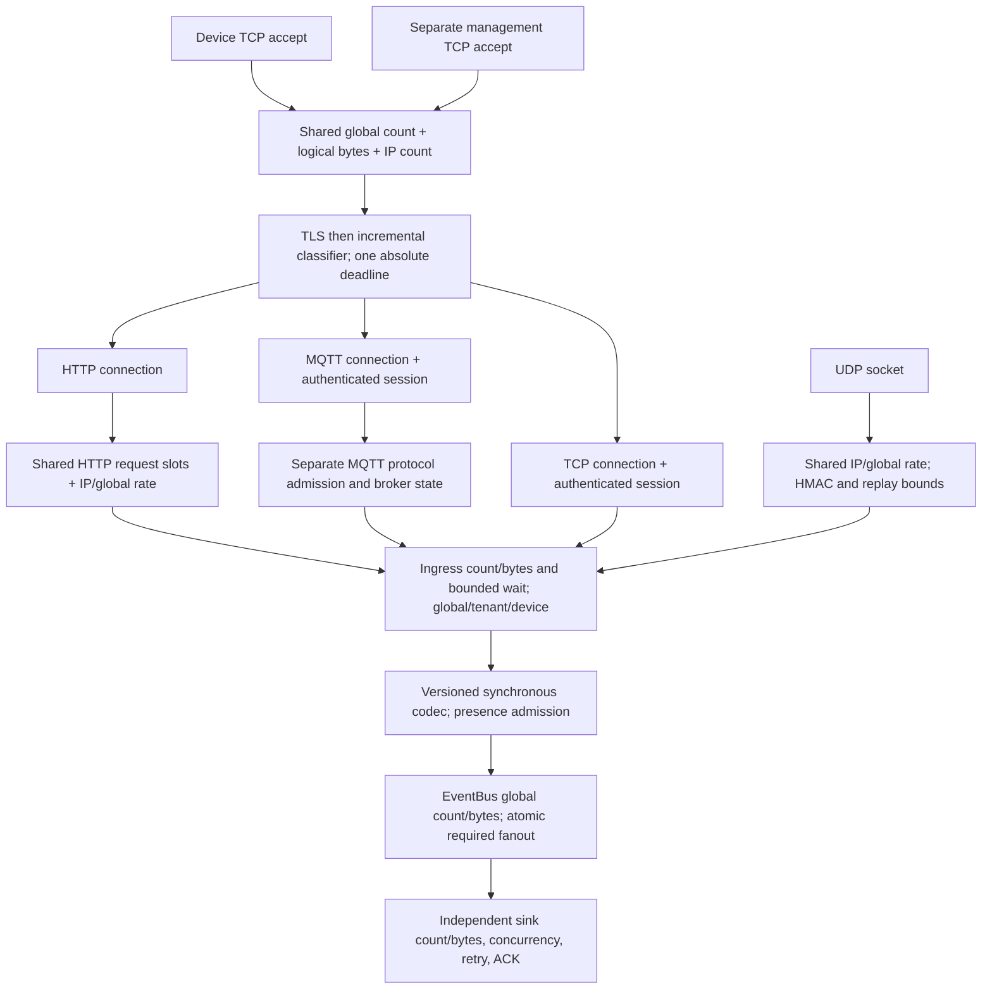

# Mixed protocol capacity and fairness audit

Audit in progress. Baseline production revision: `bf9c611bc16d1fb9c95b21c939f9ef00e4530ddc`.
Measurements use its saved release binary; changing audit tools does not rebuild that binary.
No production change preceded the baseline starvation experiment.

This is a contention/fairness audit, not a production network capacity claim.
Server and generator share a macOS loopback host. TLS authenticates the checked-in
localhost certificate. HTTPS, standard MQTT 3.1.1 QoS1, and length-framed TCP use the
same TLS TCP listener; signed NBI1/NBA1 uses UDP on the same numerical port.

## Actual baseline resource topology

| Scope | Actual baseline resource |
|---|---|
| Process | 256 connection permits and 128 MiB logical reservation; active ingress 16 / 2 MiB; 16 / 2 MiB waiters; 25 ms wait; shared rate table; auth/config caches; EventBus 16,384 / 64 MiB |
| IP | Connection count 32; fixed one-second request rate shared by TCP accept, HTTP requests and UDP datagrams |
| Tenant | 64 authenticated stream connections; ingress 4; message rate; broker, replay, presence and command bounds |
| Device | 2 stream connections; ingress 1; message rate; immutable MQTT/TCP authentication; UDP replay entries |
| Connection | Pending and classified connections own the same count/byte permits; 512 KiB logical reservation; bounded frame buffers, deadlines, command queues and MQTT protocol state |
| Protocol | Classified connection counters only, no connection maxima/reservations. HTTP request slots and MQTT protocol admission are separate gates. UDP has one sequential receive/accept/ACK owner and no connection lease |
| Sink | Default required queue 4,096 / 16 MiB; concurrency 8; timeout and retry. One sink's failure must not grant acceptance without ownership |

Evidence: `quota.rs` (`Connections`, `Admission`, `RateLimiter`), `common.rs`
(`Services::with_http_role`, `serve_listener`), server composition, and the HTTP,
MQTT, TCP and UDP adapters. Management has a separate listener and authorization,
but shares `Connections`, rates and HTTP request slots. It can lose new admission
when devices exhaust global slots. The audit does not redesign management.

`http.rs` explicitly sets `keep_alive(false)`. Consequently a requested reuse mode
observes `Connection: close` and reconnects; there is no genuine keep-alive profile
to benchmark on this revision. HTTP latency includes TCP/TLS setup. MQTT/TCP latency
measures established-session acceptance; their connection histograms are separate.

## Method

The bounded Rust driver is `netbaiot-loadgen --mixed <json>`. There is one owned task
per worker, a finite in-flight window, bounded parsers and an absolute shutdown
deadline. It verifies CONNACK/PUBACK, TCP acceptance receipts, HTTP 202, and NBA1
magic/version/boot/sequence/HMAC. It drains UDP receipts during and after sending.
No task is spawned per message. Warmup is excluded from latency and event counters.

Offered rates are open-loop schedules. `schedule_missed` and `client_window_full`
are explicit generator limits. Accepted/s, accepted/attempted and accepted/offered
must be read together: losing most scheduled requests is not a successful capacity
measurement. ACK histograms describe successful receipts, not timed-out requests.
Wire errors and aggregate server classifier/admission/EventBus counters are retained
separately; a TCP close cannot reliably identify which internal gate rejected it.

`scripts/perf/mixed_ingress_audit.py` owns server, generator and optional real HTTP
sink, captures one-second samples, and serializes runs with a lock. TLS resumption
is disabled in the Rust client. Server Tokio worker count is 10; generator count is
2. Configuration and binary SHA256 are saved for every run. Public demo credentials
only are generated. Per-IP and tenant connections are raised to 256 for the
single-IP experiment; deliberate rate limits are raised to 2,000,000/s. Other
bounds are recorded explicitly. Immediate required AuditSink isolates ingress CPU;
a separate real slow required webhook tests queue pressure and recovery.

Counters include per-protocol failures, disconnects and latency; server CPU time,
RSS, runtime task count, connection gauges, queues and rejection/timeout counters.
Process CPU 100% means one CPU core, with ten available on this host. Kernel network
counters are host-wide and can include unrelated traffic. There is no new production
telemetry dependency. The single required sink's pending depth is represented by
`pending_required`; per-sink gauges are unavailable.

## Baseline findings so far

With 256 authenticated idle MQTT clients established before probes, new HTTPS,
MQTTS and TLS TCP probes cannot enter. UDP still receives valid acceptance ACKs.
This is a global connection-slot cliff at low CPU, not a throughput capacity ceiling.
Raw runs in `docs/performance/mixed-ingress` retain all counts and samples. Follow-up
runs and any production experiment must remain separate from this baseline evidence.
