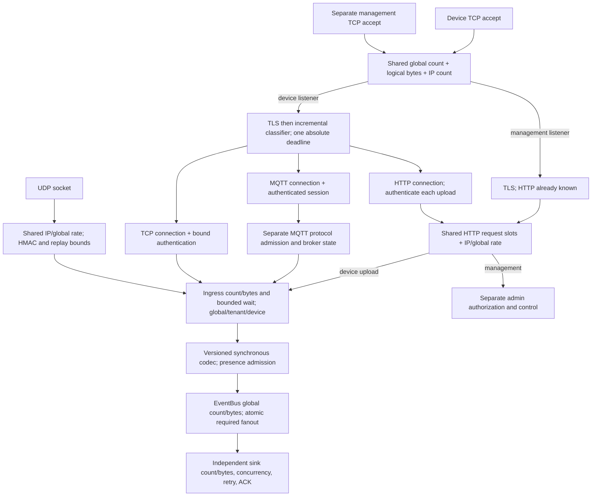

# Mixed protocol capacity and fairness audit

> Historical report: describes the revision measured when it was written, not the
> current device protocol surface. Device HTTP has since been removed. Current
> behavior, migration, tests and measurements: [removal report](remove-device-http.md).
> Original measurements are retained; old HTTP benchmark tools can be retrieved
> from baseline `945fe5e386d623c32e2c7d2d0568fe0c058107ec`.

**Decision: KEEP_FIX** for the classified-protocol anti-monopoly ceiling.
The separate pending-cap experiment was reverted. This decision does not claim
complete fairness under every shared resource limit.

Baseline production revision: `bf9c611bc16d1fb9c95b21c939f9ef00e4530ddc`.
Measured final production revision: `ff9e959397ddc2981758a8ae821f6be29d9038e9`.
Measurements use saved release binaries; changing audit tools does not rebuild them.
No production change preceded the baseline starvation experiment.

This is a contention/fairness audit, not a production network capacity claim.
Server and generator share a macOS loopback host. TLS authenticates the checked-in
localhost certificate. HTTPS, standard MQTT 3.1.1 QoS1, and length-framed TCP use the
same TLS TCP listener; signed NBI1/NBA1 uses UDP on the same numerical port.

## Worker-count erratum (device-HTTP removal review)

Both the baseline `adf3383` and integrated `945fe5e` load generators explicitly
use `#[tokio::main(flavor = "multi_thread", worker_threads = 4)]`. The mixed driver
runs inside this runtime. `TOKIO_WORKER_THREADS=2` was ignored. All formal and
worker-diagnostic runs therefore used **four actual generator workers**; raw JSON
worker labels describe the requested environment, not effective runtime threads.
The former causal claim that doubling workers improved UDP by 4.64% is withdrawn:
that observed difference is repeat-to-repeat variation under the same worker count.
It cannot diagnose generator scaling. Server worker count remains ten. Raw counts,
latencies and executable hashes are unchanged. The protocol-cap comparison did not
change actual generator workers between its two sides.

## Actual baseline resource topology



| Scope | Actual baseline resource |
|---|---|
| Process | 256 connection permits and 128 MiB logical reservation; active ingress 16 / 2 MiB; 16 / 2 MiB waiters; 25 ms wait; shared rate table; auth/config caches; EventBus 16,384 / 64 MiB |
| IP | Connection count 32; fixed one-second request rate shared by TCP accept, HTTP requests and UDP datagrams |
| Tenant | 64 authenticated stream connections; ingress 4; message rate; broker, replay, presence and command bounds |
| Device | 2 stream connections; ingress 1; message rate; immutable MQTT/TCP authentication; UDP replay entries |
| Connection | Pending and classified connections own the same count/byte permits; 512 KiB logical reservation; bounded frame buffers, deadlines, command queues and MQTT protocol state |
| Protocol | Classified connection counters only, no connection maxima/reservations. HTTP request slots and MQTT protocol admission are separate gates. UDP has one sequential receive/accept/ACK owner and no connection lease |
| Sink | Default required queue 4,096 / 16 MiB; concurrency 8; timeout and retry. One sink's failure must not grant acceptance without ownership |

Evidence: `quota.rs` (`Connections`, `Admission`, `RateLimiter`), `common.rs`
(`Services::with_http_role`, `serve_listener`), server composition, and the HTTP,
MQTT, TCP and UDP adapters. Management has a separate listener and authorization,
but shares `Connections`, rates and HTTP request slots. It can lose new admission
when devices exhaust global slots. The audit does not redesign management.

`http.rs` explicitly sets `keep_alive(false)`. Consequently a requested reuse mode
observes `Connection: close` and reconnects; there is no genuine keep-alive profile
to benchmark on this revision. HTTP latency includes TCP/TLS setup. MQTT/TCP latency
measures established-session acceptance; their connection histograms are separate.

## Method

The bounded Rust driver is `netbaiot-loadgen --mixed <json>`. There is one owned task
per worker, a finite in-flight window, bounded parsers and an absolute shutdown
deadline. It verifies CONNACK/PUBACK, TCP acceptance receipts, HTTP 202, and NBA1
magic/version/boot/sequence/HMAC. It drains UDP receipts during and after sending.
No task is spawned per message. Warmup is excluded from latency and event counters.

Offered rates are open-loop schedules. `schedule_missed` and `client_window_full`
are explicit generator limits. Accepted/s, accepted/attempted and accepted/offered
must be read together: losing most scheduled requests is not a successful capacity
measurement. ACK histograms describe successful receipts, not timed-out requests.
Wire errors and aggregate server classifier/admission/EventBus counters are retained
separately; a TCP close cannot reliably identify which internal gate rejected it.

`scripts/perf/mixed_ingress_audit.py` owns server, generator and optional real HTTP
sink, captures one-second samples, and serializes runs with a lock. TLS resumption
is disabled in the Rust client. Server Tokio worker count is 10; generator count is
4 (corrected; requested environment was 2). Configuration and binary SHA256 are saved for every run. Public demo credentials
only are generated. Per-IP and tenant connections are raised to 256 for the
single-IP experiment; deliberate rate limits are raised to 2,000,000/s. Other
bounds are recorded explicitly. Immediate required AuditSink isolates ingress CPU;
a separate real slow required webhook tests queue pressure and recovery.

Counters include per-protocol failures, disconnects and latency; server CPU time,
RSS, runtime task count, connection gauges, queues and rejection/timeout counters.
Process CPU 100% means one CPU core, with ten available on this host. Kernel network
counters are host-wide and can include unrelated traffic. There is no new production
telemetry dependency. The single required sink's pending depth is represented by
`pending_required`; per-sink gauges are unavailable.

## Environment and interpretation

The host is a Mac mini `Mac16,10`, Apple M4, 10 logical CPUs, 16 GiB RAM, macOS
26.6.2 arm64. The release toolchain is Rust 1.88.0. Server and generator both use
loopback; server Tokio workers are fixed at 10 and the formal generator at 4 (see erratum).
No kernel tuning was performed. `somaxconn=128`, TCP MSL is 15,000 ms, UDP receive
space is 786,896 bytes, and maximum UDP datagram is 9,216 bytes. The shell reports
an open-file limit of 1,048,575, while kernel file limits are 122,880 globally and
61,440 per process. The local ephemeral range is 49,152–65,535. These differing
limits are recorded rather than interpreted as a supported connection count.

The matrix uses 30-second solo/adversarial/staircase windows, three repetitions of
each important comparison, 300-second balanced and dominant-protocol windows, and
one 900-second soak. Warmup is five seconds with a one-second worker ramp. The
formal matrix has 112 runs and 154.5 minutes of measurement, excluding warmup and
cleanup. Supplementary diagnostics are separate, with their own plans and hashes.

`solo_capacity` means the repeated acknowledged rate at the selected calibrated
offered point: HTTP 8,000/s, MQTT and TCP 45,000/s, UDP 80,000/s. It is an operating
point, not an exhaustive search for a maximum. MQTT/TCP already have nonzero
admission loss at this point. `retained_capacity = mixed_ack_rate / solo_ack_rate`.
A protocol assigned a small event share naturally has a small retained ratio;
offered coverage and connection/latency behavior determine whether it is starved.

The audit attention lines are probe coverage below 95% while the host is not fully
busy, P99 above ten times the solo P99, or a sharp new-connection cliff. They are
risk screens, not a permanent SLA. Median, minimum and maximum are retained; slower
runs are not removed. In particular, one MQTT-heavy trial crosses the TCP probe
95% line, and the final candidate's 307-idle-MQTT trial has HTTP coverage below 95%.
These remaining limitations are part of the result.

Percentages are rounded; 100.00% in a table does not imply exactly zero failures.
Connection success ratios include warmup so an authentication crossing the start
boundary is not divided by a different cohort of connection attempts. Event rates
use only transmissions initiated during the measurement window, with bounded ACK
drain afterward. Failure counters record failures observed within the window and
can include a warmup operation timing out just after the start. The raw send/ACK
cohort, observed failures and generator scheduling misses remain separate.

## Backpressure and lifecycle observations

All six slow-required-sink trials reach the configured 128 pending deliveries.
During the slow interval, each protocol admits approximately one event per second
out of 100 offered, consistent with eight concurrent deliveries taking two seconds
each. HTTP receives overload responses, MQTT/TCP receive no success receipt for
rejected work, and rejected UDP work has no NBA1. Restoring the sink at the recorded
31.36-second boundary drains the backlog by approximately 34 seconds. The final
third returns all four protocols to approximately 100 acknowledged events/s.
Accepted work is neither silently dropped nor bypassed through another transport.
The exact no-false-ACK and duplicate retry assertions are in the separate semantic
test described below.

After load, required count/bytes and device connections return to zero. A real
webhook has additional owned resources compared with the immediate AuditSink:
`HttpSink::new` bounds idle HTTP connections by `sink_delivery_concurrency` (8),
and hyper-util owns one pool expiration task canceled when its pool is dropped.
Observed cooldown file descriptors rise from 12 to 15–20, with matching connection
pool tasks. The verifier allows only the configured pool bound plus that one timer;
it continues to require zero device/event ownership and normal process exit.
The immediate AuditSink returns to its five-task idle baseline.

All three mixed shutdown trials signal at the recorded 16.34–16.37 seconds, observe
management status in `draining`, commit a 64,160-byte event recovery spool plus MQTT
recovery state, and exit with code zero without a forced kill. These load clients
use CleanSession=1; persistent MQTT replay and stable event IDs are separately
proved by the targeted restart semantic test. No crash-durability claim is made.

## Data quality and diagnostic boundaries

The management observer originally failed to reset Python HTTP state after a TLS
admission failure. Six default-IP trials were preserved under `diagnostics/` and
repeated with the corrected observer. Older preliminary comparisons retain their
observer warnings; they are not used to claim successful management recovery.
Formal device receipt and process CPU data were independently collected.

The clock alignment check found a roughly 222 ms wall-clock step in one final TLS
pending trial, while client monotonic samples still cover the full 30 seconds.
Verification aligns legacy final timestamps with their adjacent monotonic sample
and records the offsets. New diagnostic output directly includes monotonic elapsed
time. Throughput uses the monotonic send window; wall-clock process sampling in
that short trial has a correspondingly small timing uncertainty.

At the 9,600 HTTP/s exploratory step, the host produced `EADDRNOTAVAIL`, broad
connection/read failures, long flat receipt intervals and almost no server CPU
progress during those intervals. The error was observed in the independent
management client as well. This is evidence of a local address/socket allocation
limit, not sufficient evidence of a gateway scheduling bug. The original result
is preserved and the repeated diagnostics below confirm the failure while preserving the
uncertainty about the complete host-wide stall mechanism.
The original generator grouped this OS error into `remote_close`; the diagnostic
version records `connect_address_unavailable` separately. Uninstrumented older
records remain unknown for that category, not zero.

The available macOS TCP statistics snapshots report all zeros despite active TCP
traffic, so they cannot prove absence of listen-queue overflow. UDP kernel counters
are host-wide. There is no per-thread scheduler, context-switch or syscall profile,
no separate-host run, and no sendmmsg experiment. In particular, the UDP-heavy
shared-host/window limit cannot establish that NBA1 send syscalls are the cause.

## Reproduced connection-slot starvation

With 256 authenticated idle MQTT clients established before probes, new HTTPS,
MQTTS and TLS TCP probes cannot enter. UDP still receives valid acceptance ACKs.
This is a global connection-slot cliff at low CPU, not a throughput capacity ceiling.
Three corrected formal trials reproduce this, in addition to the original three
pre-change trials. At 51, 102, 154 and 205 idle MQTT connections, all new probes
complete; at 256 and 307 the baseline HTTPS/MQTT/TCP probes are zero. UDP remains
deliverable. Server CPU is approximately 0.04 cores at the full-slot cliff.

## Repeated solo operating points

Rates are acknowledged events/s. These are the highest calibrated offered points selected for repetition, not a formal maximum or zero-error SLA. Percentiles are medians of per-run successful-receipt percentiles. Ranges are across repeats.

| Protocol | N | Accepted/s | Range | ACK/attempted % | ACK/offered % | P95 ms | P99 ms |
|---|---|---|---|---|---|---|---|
| http | 3 | 7,865 | 7,847–7,865 | 100.00 | 98.31 | 1.76 | 2.94 |
| mqtt | 3 | 43,714 | 43,646–43,729 | 97.59 | 97.14 | 1.20 | 1.99 |
| tcp | 3 | 43,823 | 43,708–43,868 | 97.74 | 97.38 | 1.10 | 1.81 |
| udp | 3 | 79,986 | 79,928–80,000 | 100.00 | 99.98 | 7.30 | 10.49 |

## TLS mixed throughput and resources

These five scenario tables use the frozen baseline. Each key mixed run lasts 300 measurement seconds; warmup is excluded. Final-candidate paired costs are reported separately below. CPU is process CPU time expressed in cores. RSS is the median run peak.

| Scenario | N | HTTP/s (coverage) | MQTT/s (coverage) | TCP/s (coverage) | UDP/s (coverage) | CPU cores | RSS MiB |
|---|---|---|---|---|---|---|---|
| balanced | 3 | 5,930 (98.8%) | 5,978 (99.6%) | 5,979 (99.6%) | 5,998 (100.0%) | 4.12 | 11.67 |
| mqtt-heavy | 3 | 4,887 (97.7%) | 32,392 (92.5%) | 4,843 (96.9%) | 4,956 (99.1%) | 4.82 | 14.67 |
| http-heavy | 3 | 6,830 (97.6%) | 1,000 (100.0%) | 1,000 (100.0%) | 1,000 (100.0%) | 4.13 | 11.27 |
| tcp-heavy | 3 | 4,896 (97.9%) | 4,854 (97.1%) | 32,527 (92.9%) | 4,958 (99.2%) | 4.75 | 13.09 |
| udp-heavy | 3 | 6,877 (98.2%) | 6,910 (98.7%) | 6,910 (98.7%) | 25,151 (51.3%) | 6.52 | 12.22 |

## Spread across mixed repetitions

Minimum–maximum across complete trials, including slower runs. These are observed ranges, not confidence intervals.

| Scenario | Protocol | ACK/s range | Offered coverage % range | P99 ms range |
|---|---|---|---|---|
| balanced | http | 5,928–5,931 | 98.80–98.85 | 2.97–3.00 |
| balanced | mqtt | 5,978–5,980 | 99.64–99.67 | 1.12–1.13 |
| balanced | tcp | 5,978–5,980 | 99.64–99.67 | 1.12–1.13 |
| balanced | udp | 5,997–5,998 | 99.95–99.97 | 6.28–6.35 |
| mqtt-heavy | http | 4,787–4,888 | 95.75–97.77 | 5.44–6.89 |
| mqtt-heavy | mqtt | 30,594–32,417 | 87.41–92.62 | 4.15–5.83 |
| mqtt-heavy | tcp | 4,708–4,843 | 94.16–96.86 | 2.38–3.26 |
| mqtt-heavy | udp | 4,923–4,956 | 98.46–99.12 | 6.21–11.44 |
| http-heavy | http | 6,827–6,872 | 97.53–98.17 | 2.58–2.80 |
| http-heavy | mqtt | 999–1,000 | 99.94–99.99 | 0.79–0.88 |
| http-heavy | tcp | 1,000–1,000 | 99.95–100.00 | 0.80–0.87 |
| http-heavy | udp | 1,000–1,000 | 99.99–100.00 | 1.10–1.65 |
| tcp-heavy | http | 4,856–4,899 | 97.12–97.97 | 5.27–5.89 |
| tcp-heavy | mqtt | 4,812–4,858 | 96.24–97.17 | 2.23–2.67 |
| tcp-heavy | tcp | 31,956–32,579 | 91.30–93.08 | 3.85–4.65 |
| tcp-heavy | udp | 4,946–4,959 | 98.91–99.18 | 6.05–9.20 |
| udp-heavy | http | 6,864–6,880 | 98.05–98.29 | 4.69–4.99 |
| udp-heavy | mqtt | 6,906–6,912 | 98.66–98.75 | 2.25–2.39 |
| udp-heavy | tcp | 6,907–6,911 | 98.67–98.73 | 2.24–2.39 |
| udp-heavy | udp | 24,924–25,240 | 50.86–51.51 | 56.61–65.12 |

## Fairness and acknowledged latency

Retained capacity = mixed accepted/s divided by baseline solo accepted/s. Reduced allocated share alone is not starvation. Receipt failure % uses attempts, including failed writes, and excludes generator schedule/window drops; offered coverage in the preceding table includes them.

| Scenario | Protocol | Solo/s | Mixed/s | Retained | P95 ms | P99 ms | Receipt failure % |
|---|---|---|---|---|---|---|---|
| balanced | http | 7,865 | 5,930 | 75.4% | 1.50 | 2.99 | 0.02 |
| balanced | mqtt | 43,714 | 5,978 | 13.7% | 0.33 | 1.13 | 0.36 |
| balanced | tcp | 43,823 | 5,979 | 13.6% | 0.33 | 1.12 | 0.36 |
| balanced | udp | 79,986 | 5,998 | 7.5% | 0.41 | 6.34 | 0.04 |
| mqtt-heavy | http | 7,865 | 4,887 | 62.1% | 3.43 | 5.45 | 1.43 |
| mqtt-heavy | mqtt | 43,714 | 32,392 | 74.1% | 2.28 | 4.16 | 7.13 |
| mqtt-heavy | tcp | 43,823 | 4,843 | 11.1% | 1.32 | 2.41 | 3.14 |
| mqtt-heavy | udp | 79,986 | 4,956 | 6.2% | 1.49 | 6.47 | 0.89 |
| http-heavy | http | 7,865 | 6,830 | 86.8% | 1.58 | 2.59 | 0.00 |
| http-heavy | mqtt | 43,714 | 1,000 | 2.3% | 0.27 | 0.85 | 0.04 |
| http-heavy | tcp | 43,823 | 1,000 | 2.3% | 0.27 | 0.85 | 0.04 |
| http-heavy | udp | 79,986 | 1,000 | 1.3% | 0.28 | 1.62 | 0.01 |
| tcp-heavy | http | 7,865 | 4,896 | 62.3% | 3.28 | 5.27 | 1.23 |
| tcp-heavy | mqtt | 43,714 | 4,854 | 11.1% | 1.23 | 2.29 | 2.93 |
| tcp-heavy | tcp | 43,823 | 32,527 | 74.2% | 2.13 | 3.91 | 6.73 |
| tcp-heavy | udp | 79,986 | 4,958 | 6.2% | 1.40 | 6.20 | 0.83 |
| udp-heavy | http | 7,865 | 6,877 | 87.4% | 2.41 | 4.73 | 0.10 |
| udp-heavy | mqtt | 43,714 | 6,910 | 15.8% | 0.64 | 2.26 | 1.28 |
| udp-heavy | tcp | 43,823 | 6,910 | 15.8% | 0.64 | 2.27 | 1.29 |
| udp-heavy | udp | 79,986 | 25,151 | 31.4% | 49.65 | 57.16 | 0.01 |

## Mixed failure signals

Median rates across 300-second trials. Disconnects overlap their causal errors; do not add these columns. All remaining wire failure categories are retained in the JSON index.

| Scenario | Protocol | Receipt failure % | Disconnect/s | HTTP overload/s | UDP no ACK/s | Read timeout/s | TLS failure/s |
|---|---|---|---|---|---|---|---|
| balanced | http | 0.02 | 0.000 | 1.350 | 0.000 | 0.000 | 0.000 |
| balanced | mqtt | 0.36 | 7.983 | 0.000 | 0.000 | 0.000 | 0.000 |
| balanced | tcp | 0.36 | 7.940 | 0.000 | 0.000 | 0.000 | 0.000 |
| balanced | udp | 0.04 | 0.000 | 0.000 | 2.343 | 0.000 | 0.000 |
| mqtt-heavy | http | 1.43 | 0.000 | 70.957 | 0.000 | 0.000 | 0.000 |
| mqtt-heavy | mqtt | 7.13 | 302.153 | 0.000 | 0.000 | 0.000 | 0.000 |
| mqtt-heavy | tcp | 3.14 | 101.633 | 0.000 | 0.000 | 0.000 | 0.000 |
| mqtt-heavy | udp | 0.89 | 0.000 | 0.000 | 44.700 | 0.000 | 0.000 |
| http-heavy | http | 0.00 | 0.000 | 0.030 | 0.000 | 0.000 | 0.000 |
| http-heavy | mqtt | 0.04 | 0.303 | 0.000 | 0.000 | 0.000 | 0.000 |
| http-heavy | tcp | 0.04 | 0.283 | 0.000 | 0.000 | 0.000 | 0.000 |
| http-heavy | udp | 0.01 | 0.000 | 0.000 | 0.097 | 0.000 | 0.000 |
| tcp-heavy | http | 1.23 | 0.000 | 61.047 | 0.000 | 0.000 | 0.000 |
| tcp-heavy | mqtt | 2.93 | 96.887 | 0.000 | 0.000 | 0.000 | 0.000 |
| tcp-heavy | tcp | 6.73 | 308.643 | 0.000 | 0.000 | 0.000 | 0.000 |
| tcp-heavy | udp | 0.83 | 0.000 | 0.000 | 41.553 | 0.000 | 0.000 |
| udp-heavy | http | 0.10 | 0.000 | 6.573 | 0.000 | 0.000 | 0.000 |
| udp-heavy | mqtt | 1.28 | 23.883 | 0.000 | 0.000 | 0.000 | 0.000 |
| udp-heavy | tcp | 1.29 | 23.960 | 0.000 | 0.000 | 0.000 | 0.000 |
| udp-heavy | udp | 0.01 | 0.000 | 0.000 | 3.297 | 0.000 | 0.000 |

## Paired production-candidate cost

Interleaved baseline/final runs use the same generator and offered workloads.

| Scenario | Before N | After N | Before/s | After/s | Delta | CPU cores before → after | RSS MiB before → after |
|---|---|---|---|---|---|---|---|
| solo-http | 3 | 3 | 7,865 | 7,859 | -0.08% | 5.23 → 5.22 | 8.27 → 8.16 |
| solo-mqtt | 3 | 3 | 43,714 | 43,797 | 0.19% | 1.98 → 1.96 | 9.69 → 9.47 |
| solo-tcp | 3 | 3 | 43,823 | 43,775 | -0.11% | 1.90 → 1.90 | 9.67 → 9.33 |
| balanced | 3 | 3 | 23,883 | 23,883 | 0.00% | 4.12 → 4.12 | 11.67 → 12.34 |

## Connection interference

Values are accepted/offered coverage except `new MQTT auth`, which is application-authenticated/connection-attempt percentage including warmup. TCP/TLS connection success is also preserved separately in JSON. Blank means no such probe, not zero errors.

| Scenario | N | HTTP % | MQTT % | TCP % | UDP % | New MQTT auth % | CPU cores |
|---|---|---|---|---|---|---|---|
| baseline/idle-final-256 | 3 | 0.00 | 0.00 | 0.00 | 100.00 | — | 0.04 |
| candidate/idle-256-v3 | 3 | 98.23 | 0.00 | 100.00 | 100.00 | — | 1.96 |
| final/idle-final-256 | 3 | 98.37 | 0.00 | 100.00 | 100.00 | — | 1.97 |
| baseline/default-ip-occupancy-32 | 3 | 0.00 | 0.00 | 0.00 | 100.00 | — | 0.03 |
| final/default-ip-occupancy-32 | 3 | 0.00 | 0.00 | 0.00 | 100.00 | — | 0.03 |
| baseline/tls-pending-v3 | 3 | 5.77 | 97.47 | 97.40 | 100.00 | — | 0.07 |
| candidate/tls-pending-v3 | 3 | 0.37 | 40.37 | 48.00 | 100.00 | — | 0.09 |
| final/tls-pending-final | 3 | 6.10 | 97.33 | 97.50 | 100.00 | — | 0.07 |
| baseline/slow_http-established-and-new | 3 | 4.87 | 100.00 | 100.00 | 100.00 | 7.01 | 0.33 |
| final/slow_http-established-and-new | 3 | 2.13 | 100.00 | 100.00 | 100.00 | 97.12 | 2.03 |
| baseline/slow_tcp-established-and-new | 3 | 4.77 | 100.00 | 100.00 | 100.00 | 7.04 | 0.34 |
| final/slow_tcp-established-and-new | 3 | 98.47 | 100.00 | 100.00 | 100.00 | 97.46 | 2.18 |
| baseline/unclassified-established-and-new | 3 | 5.00 | 100.00 | 100.00 | 100.00 | 9.12 | 0.33 |
| baseline/tls_storm-established-and-new | 3 | 100.00 | 100.00 | 100.00 | 100.00 | 100.00 | 5.29 |

## Offered-load staircases

Exploratory steps are one 30-second run each; repeated saturation trials above validate the connection cliff. Percentages refer to the calibrated offered operating points (HTTP 8,000/s; UDP 80,000/s), or 256 idle connections for occupancy. Actual attempt rates and window misses remain in JSON.

### http-cliff

| Build | Load % | HTTP coverage/P99 ms | MQTT coverage/P99 ms | TCP coverage/P99 ms | UDP coverage/P99 ms |
|---|---|---|---|---|---|
| baseline | 20 | 99.8% / 4.70 | 100.0% / 0.93 | 100.0% / 0.93 | 100.0% / 1.00 |
| baseline | 40 | 97.9% / 4.00 | 100.0% / 0.71 | 100.0% / 0.73 | 100.0% / 1.73 |
| baseline | 60 | 97.0% / 2.75 | 100.0% / 0.87 | 100.0% / 0.88 | 100.0% / 2.77 |
| baseline | 80 | 96.5% / 2.89 | 100.0% / 1.12 | 100.0% / 1.21 | 100.0% / 2.84 |
| baseline | 100 | 98.0% / 3.45 | 100.0% / 1.05 | 100.0% / 1.11 | 100.0% / 1.29 |
| baseline | 120 | 47.5% / 5.42 | 51.3% / 3.18 | 50.9% / 3.11 | 49.9% / 6.74 |

### udp-cliff

| Build | Load % | HTTP coverage/P99 ms | MQTT coverage/P99 ms | TCP coverage/P99 ms | UDP coverage/P99 ms |
|---|---|---|---|---|---|
| baseline | 20 | 99.2% / 1.93 | 100.0% / 0.80 | 100.0% / 0.79 | 100.0% / 6.25 |
| baseline | 40 | 99.2% / 1.62 | 100.0% / 0.76 | 100.0% / 0.79 | 99.9% / 9.36 |
| baseline | 60 | 99.9% / 2.02 | 100.0% / 0.85 | 100.0% / 0.82 | 99.9% / 7.16 |
| baseline | 80 | 100.0% / 1.43 | 100.0% / 0.61 | 100.0% / 0.61 | 99.9% / 5.84 |
| baseline | 100 | 100.0% / 1.34 | 100.0% / 0.19 | 100.0% / 0.19 | 92.8% / 15.24 |
| baseline | 120 | 100.0% / 0.93 | 100.0% / 0.16 | 100.0% / 0.16 | 77.4% / 14.57 |

### occupancy-cliff

| Build | Load % | HTTP coverage/P99 ms | MQTT coverage/P99 ms | TCP coverage/P99 ms | UDP coverage/P99 ms |
|---|---|---|---|---|---|
| baseline | 20 | 100.0% / 4.42 | 100.0% / 0.51 | 100.0% / 0.50 | 100.0% / 0.47 |
| final | 20 | 100.0% / 4.37 | 100.0% / 0.45 | 100.0% / 0.46 | 100.0% / 0.44 |
| baseline | 40 | 100.0% / 4.59 | 100.0% / 0.55 | 100.0% / 0.56 | 100.0% / 0.57 |
| final | 40 | 100.0% / 4.43 | 100.0% / 0.46 | 100.0% / 0.46 | 100.0% / 0.43 |
| baseline | 60 | 100.0% / 4.54 | 100.0% / 0.51 | 100.0% / 0.52 | 100.0% / 0.52 |
| final | 60 | 100.0% / 4.43 | 100.0% / 0.48 | 100.0% / 0.49 | 100.0% / 0.49 |
| baseline | 80 | 100.0% / 4.56 | 100.0% / 0.68 | 100.0% / 0.66 | 100.0% / 0.62 |
| final | 80 | 100.0% / 5.85 | 0.0% / — | 100.0% / 2.46 | 100.0% / 3.07 |
| baseline | 100 | 0.0% / — | 0.0% / — | 0.0% / — | 100.0% / 0.77 |
| final | 100 | 97.8% / 8.99 | 0.0% / — | 100.0% / 5.32 | 100.0% / 5.09 |
| baseline | 120 | 0.0% / — | 0.0% / — | 0.0% / — | 100.0% / 2.06 |
| final | 120 | 94.7% / 8.68 | 0.0% / — | 100.0% / 4.83 | 100.0% / 4.86 |


## Isolated production experiments

The first experiment, `3d2d2c47ec8ea43d28ded60699bf6694ae3c86dd`, added a
192-connection ceiling per classified device protocol and a 64-connection ceiling
for unclassified device connections. It reused existing global/IP/byte ownership.
No production change preceded the repeated baseline idle-MQTT starvation evidence.

The pending ceiling failed its fairness experiment. In three paired 30-second TLS
pending trials, HTTP probe coverage was approximately 5.4–5.8% on the baseline and
0.2–0.4% with the smaller pending pool. MQTT/TCP admission also worsened. A smaller
shared pool still cannot identify legitimate, as-yet-unclassified clients. These
negative results remain in the evidence directory. The earlier unpaced reconnect
trial is retained only as diagnostics, not included in the result aggregates.

Commit `ff9e959397ddc2981758a8ae821f6be29d9038e9` removes the extra pending ceiling.
This is the frozen final production candidate measured by the formal matrix.
Pending clients retain the original global count, logical bytes, IP bounds and
absolute connection deadline. There is no additional semaphore or pending queue.

The remaining change is `max_device_connections_per_protocol`, a positive absolute
configuration value defaulting to 192 for each of HTTP, MQTT and generic TCP on the
shared device listener. After TLS and protocol detection, the same connection lease
atomically charges its classified-protocol count under the existing connection
mutex. Failure drops the original global/IP/byte ownership. Drop decrements both
classified counters. Classification and release are connection-level operations;
no per-request, per-publish or per-frame lock is introduced.

The maxima overlap and may sum above the global maximum. They are not guaranteed
reservations: several protocols together, pending TLS clients, or a tighter shared
IP/tenant limit can still exhaust capacity. Management and standalone transport
listeners retain their original admission. Raising the global maximum does not
automatically raise the protocol ceiling; operators must size both values. At the
default global maximum, single-protocol classified occupancy changes from 256 to
192, a deliberate 25% reduction in its maximum connection count.

Three final idle-MQTT trials recovered HTTPS probe coverage from 0% to approximately
98.3%, and TCP/UDP to 100%, while classified MQTT stayed at or below 192. New MQTT
clients remain rejected when their own ceiling is full. Excess clients retry TLS,
raising server CPU from roughly 0.04 cores to 2 cores and HTTPS P99 to roughly
8–9 ms. This post-TLS rejection cost is part of the result. The repeated throughput comparison passes: balanced medians are 23,883.233/s
before and 23,883.433/s after (+0.00084%); the worst paired change is about -0.15%.
Solo HTTP/MQTT/TCP median changes are -0.08%, +0.19% and -0.11%. Balanced CPU is
4.116 versus 4.118 cores. Median sampled peak RSS increases from 11,952 to 12,640
KiB (+688 KiB, 5.8%); the three candidate peaks span 12,304–14,608 KiB. This is
an observed process-level cost, not a causal allocation estimate for four counters.
The third candidate balanced run also has higher P99 (HTTP 3.94, MQTT 1.58, TCP
1.59, UDP 9.58 ms); it remains in the comparison.

## Acceptance and planned-restart correctness

The bounded `mixed_ingress_semantics.py` scenario passed on baseline, the initial
experiment and the final candidate. The final correctness run uses the exact same
server binary SHA256 as the performance matrix.

Four events, one from each transport, fill a deliberately failed required sink.
Additional uploads cannot cross EventAccepted: HTTPS returns 429, MQTT and TCP
close without a successful receipt, and UDP supplies no NBA1, including for a
repeated sequence whose prior ingestion failed. After SIGTERM, device ingress
closes while management remains available to observe unready state. Accepted work
commits to the restart spool and the process exits successfully. Restart replays
the same four stable event IDs, restores an unacknowledged persistent MQTT QoS1
publication with DUP and session-present, and allows the previously rejected UDP
sequence to succeed. This proves the exercised acceptance/restart boundary; it is
not a claim of crash durability or exactly-once delivery.

Unit and real-TLS regressions exercise concurrent classification, global count and
byte rollback, failed/invalid transitions, cancellation before classification,
other-protocol acceptance at one protocol's ceiling, management admission within
remaining global capacity, and final ownership release.

## Validation completed before measurement

The following all passed on the final production candidate and audit driver:

```sh
cargo +1.88.0 fmt --all -- --check
cargo +1.88.0 check --workspace --all-targets
cargo +1.88.0 clippy --workspace --all-targets --all-features -- -D warnings
cargo +1.88.0 test --workspace --all-targets --all-features
cargo +1.88.0 test --workspace --all-features
python3 tests/mqtt_conformance/run.py --release-gate --no-build
RUSTUP_TOOLCHAIN=1.88.0 bash scripts/tutorial_smoke.sh
cargo +1.88.0 test -p netbaiot-server --test server subprocess_graceful_restart_sixty_second_soak -- --ignored --nocapture
cargo +nightly fuzz run device_classifier -- -max_total_time=60 -max_len=4096
cargo +nightly fuzz run udp_envelope -- -max_total_time=60 -max_len=1201
```

Each workspace test invocation reported 166 passed, zero failed and four ignored.
The ignored restart soak was then run explicitly and passed in 61.81 seconds;
the other three ignored cases are manual queue-depth/recovery/route benchmarks.
MQTT release conformance passed 76/76 gates, including mature external Mosquitto
client interoperability/differential coverage, with current evidence for 125/125
normative requirements. Classifier fuzzing completed 977,962 executions and UDP
framing fuzzing 669,805 executions, each in 61 seconds, without failure. UDP and
resource tests are included in the workspace suite. No compilation or test suite
runs concurrently with the formal performance matrix.

Machine-readable validation and exact raw runs are under
[performance/mixed-ingress](performance/mixed-ingress/README.md). The formal matrix
completed all 112 planned runs (9,270 measurement seconds). The verifier reports
zero missing runs and zero invariant failures, with one frozen server hash per
variant. It checks complete monotonic windows, valid receipts, bounded cooldown
ownership and normal child exit; performance attention-line crossings remain
findings rather than being hidden by a binary validation pass.

## Fifteen-minute soak

The final candidate offered 4,000 events/s per protocol for 900 seconds. Mean
acknowledged rates were HTTP 3,890.996/s, MQTT 3,962.547/s, TCP 3,961.758/s and UDP
3,996.758/s. CPU averaged 2.528 server cores and 0.819 generator cores. HTTPS
coverage is about 97.27%, MQTT/TCP about 99.06%/99.04%, and UDP 99.92%; this is a
stable workload with bounded admission loss, not a zero-error operating point.

| Measure | First five minutes | Last five minutes |
|---|---:|---:|
| HTTP ACK/s | 3,890.41 | 3,891.53 |
| MQTT ACK/s | 3,964.84 | 3,961.66 |
| TCP ACK/s | 3,963.03 | 3,961.32 |
| UDP ACK/s | 3,996.95 | 3,996.69 |
| Median RSS KiB | 11,984 | 11,776 |
| Median pending required | 0 | 0 |
| Sampled pending peak | 46 | 98 |
| Median runtime tasks | 73 | 73 |

RSS started at 10,992 KiB, peaked at 12,128 and ended at 11,808. The small retained
increase is recorded; the three five-minute medians were 11,984/11,520/11,776 KiB,
so no monotonic growth trend was observed over this window. Peak tasks were 87.
After traffic, device connections and event count/bytes/pending work were zero,
tasks returned to five, and numeric file descriptors returned from 12 to 12.
Cumulative P99 at 300 seconds was H/M/T/U 3.44/1.66/1.62/7.83 ms; final cumulative
P99 was 3.51/1.65/1.63/7.82 ms. These are cumulative successful-receipt percentiles,
not independent interval tail percentiles. No invalid receipt or forced exit was
observed; 15 minutes cannot establish indefinite soak stability.

## Diagnosis and remaining limits

The reproducible zero-throughput cliff is connection ownership: idle clients use
all 256 global slots while the CPU remains mostly idle. Slow classified HTTP/TCP
clients similarly deny new sessions while established sessions continue. The
192 classified-device ceiling addresses this single-protocol monopoly. It does
not grant hard reservation or fairness within one protocol. Slow HTTP still
starves new HTTP at its own cap; new MQTT cannot enter when MQTT itself is full.
At 307 attempted idle MQTT clients, candidate HTTP coverage falls to 94.7% and
server CPU reaches about 2.84 cores because excess clients retry TLS.

The unchanged same-IP limit of 32 is another independent cliff, reproduced on
both variants. Long pending TLS and completed-but-unclassified connections can
still consume global slots before the protocol is known. A storm offered at
8,000 short TLS handshakes/s kept all measured probes at approximately 100%
coverage, with HTTPS P99 around 14 ms and established MQTT/TCP around 4 ms;
this does not contradict starvation by long-lived pending connections.

High MQTT/TCP event load also competes for shared ingress admission (global 16,
tenant 4, device 1), distinct from connection occupancy. The third MQTT-heavy
trial's TCP offered coverage is 94.16%, with HTTP 95.75%, MQTT 87.41% and UDP
98.46%. All 226,022 observed ingress rejects match the ingress-admission counter;
auth and codec failures are zero, and sampled EventBus depth peaks at 598 below
the 4,096 required-sink limit. The host snapshot still has 25.16% idle CPU.
This is a remaining admission-pressure risk, not proof that all mixed workloads
are fair. The separate tenant-limit diagnostic below shows that raising this limit
moves pressure into the required queue and makes the result worse; it does not
justify changing production defaults.

UDP offered at 80,000/96,000 packets/s with 1,000/s TCP-side probes acknowledges
about 74,230/74,310 UDP events/s; the finite client window limits actual injection.
All TCP-side probes stay approximately 100%, with MQTT/TCP P99 around 0.16–0.19 ms.
The 70% UDP heavy mixture instead has approximately 25,151 UDP ACK/s out of 49,000
offered, many client-window drops, server CPU 6.52 cores and generator CPU about
1.78 CPU cores with four runtime workers. The first host snapshot has only 8.43% CPU idle. UDP P99
rises to 56.61–65.12 ms, while MQTT/TCP P99 remains 2.24–2.39 ms (below ten times
solo). No UDP full-socket-buffer drop was reported in that first trial, but the
counter is host-wide. The mislabeled generator-worker diagnostic below did not vary runtime workers;
neither experiment identifies NBA1 send syscall cost. No UDP batching/sendmmsg change was
made.

Slow required delivery is deliberate shared backpressure: all four transports lose
admission and recover after sink restoration. It is not an unbounded queue or a
transport that bypasses EventAccepted. Plaintext decomposition used three 30-second
runs: median CPU was 1.434 cores, but total acknowledged rate was approximately
23,400/s due to admission contention. Lower TLS cost alone therefore does not imply
higher accepted throughput at unchanged ingress limits.


## Answers to the audit questions

| Question | Supported conclusion |
|---|---|
| HTTP pressure versus MQTT | At 7,000 HTTP uploads/s in the heavy mixture, MQTT probes remain 99.94–99.99% covered. Slow HTTP connection occupancy severely reduces new MQTT admission on baseline; the classified cap restores its 100/s offered event probe. |
| Idle MQTT versus HTTP/TCP | Yes: 256 idle sessions exhaust global slots and reduce both to zero. The final cap restores other-protocol admission, subject to shared limits and retry cost. |
| Slow TCP versus other protocols | Baseline new HTTP/MQTT admission degrades while established sessions remain stable. The final cap restores other protocols after classification. |
| UDP PPS versus TCP latency | No ten-times-solo MQTT/TCP P99 cliff appears in the measured UDP stairs or heavy mixture. The generator and shared host limit the offered-to-actual rate. |
| NBA1 send bottleneck | Not established. No syscall attribution was collected, and generator-window/CPU limits are visible. No UDP production experiment is justified. |
| Required-sink backpressure | All four transports reject without false success and recover after restoration. The separate semantic test includes rejected duplicate UDP sequences. |
| Shared accept starvation/HOL | Connection-slot starvation is reproduced. These samples do not isolate kernel accept scheduling or classifier head-of-line delay as a separate cause. |
| TLS storm versus existing sessions | Short offered handshake storms preserve probes; long pending/unclassified connections deny new admission. The discarded pending ceiling worsened this case. |
| One protocol at its limit | Classified occupancy can now be contained, but shared IP, pending, ingress and sink bounds still couple protocols. A single protocol at its own ceiling still rejects its new clients. |
| Graceful overload and shutdown | No false receipt or ownership leak was found in the exercised tests. Three mixed shutdowns exit normally with required spool ownership; separate restart validation preserves event IDs and persistent MQTT semantics. |

## Decision

**KEEP_FIX**: retain only the measured per-classified-protocol connection ceiling.
It addresses a repeatable, low-CPU global-slot monopoly and passes the <=5% balanced
throughput regression screen, with normal solo medians within 0.2% of baseline.
**Revert the pending-cap experiment**: it reduces successful admission and cannot
identify the legitimate protocol before classification. Leave UDP handling and
all ingress/sink defaults unchanged. Do not interpret this limited fix as complete
protocol isolation or hard reserved capacity.

The cost is reduced single-protocol connection occupancy, post-TLS rejection/retry
CPU, an observed small RSS increase in balanced trials, and unchanged starvation
under lower shared IP or pre-classification limits. Connection lifecycle accounting
uses the existing mutex; no per-event lock, new semaphore, runtime broker, database,
listener split, management redesign or business TCP change is introduced.

## Known limits and integration scope

The formal production comparison is specifically baseline `bf9c611` against final
candidate `ff9e959`, identified by their binary hashes in every raw result. The
existing main branch `5427143` also contains earlier EventBus batching and metrics
work that is absent from the requested baseline. Local integration retains that
work. Results from the frozen candidate must not be advertised as measured capacity
of the combined main revision; integration correctness checks are recorded
separately. The no-push instruction applies to this audit.

All capacity/fairness measurements are same-host macOS loopback with 10 server
workers, four actual generator workers, 256-byte payloads and public fixture
identities. Key mixed trials are three times five minutes, the final soak is one
15-minute trial, and short adversarial/solo comparisons are three times 30 seconds;
exploratory staircase points are single 30-second windows. There is no separate
network host, multi-node test, production TLS termination path, context-switch or
syscall trace, multi-hour soak, or new SIGKILL/power-loss measurement. The existing
restart tests exercise planned recovery only. This is not a production SLA,
zero-loss ceiling, or crash-durability claim.

## Supplementary diagnostics

All 15 separately planned diagnostic runs completed (450 measurement seconds),
with zero completeness/receipt/cleanup failures. They use the same frozen baseline
server and a separate generator binary whose only code changes are error taxonomy
and monotonic final-time metadata. Three interleaved 30-second pairs test each
configuration change; the 9,600 HTTP/s repeats each wait 35 seconds before startup.
The original anomalous run is retained.

| Diagnostic (N=3 each) | HTTP ACK/s | MQTT ACK/s | TCP ACK/s | UDP ACK/s | Server CPU cores |
|---|---:|---:|---:|---:|---:|
| MQTT-heavy, tenant ingress 4 | 4,856 | 32,098 | 4,817 | 4,951 | 4.87 |
| MQTT-heavy, tenant ingress 16 | 3,812 | 8,508 | 3,036 | 1,766 | 5.86 |
| UDP-heavy, requested workers 2 (actual 4) | 6,832 | 6,891 | 6,895 | 23,364 | 6.59 |
| UDP-heavy, requested workers 4 (actual 4) | 6,836 | 6,907 | 6,902 | 24,447 | 6.51 |
| HTTP offered 9,600/s after settling | 4,160 | 476 | 485 | 518 | 3.29 |

Raising tenant admission 4 → 16 keeps global admission at 16. At four, all observed
rejects occur in ingress admission, and sampled EventBus peaks are 98–804. At 16,
all three runs reach 4,096 pending events; total ingress rejects are 101,347–105,552,
while only 51–153 are ingress-admission rejects. Auth/codec errors remain zero.
The workload now overloads the downstream required queue and triggers frequent
MQTT/TCP reconnects. UDP P99 rises from a median 7.52 to 310 ms. This demonstrates
why raising one concurrency setting is unsafe as a general fairness remedy. It
also shows that a tenant admission bottleneck is not the only capacity limit.
No new contention instrumentation isolates the precise downstream CPU/lock cost.

The second set has 4.64% higher median UDP ACK rate, but both sets used four
runtime workers. Coverage was 49.89% versus 47.68% of 49,000/s; generator CPU was
1.79 versus 1.71 cores, with host samples only 8.4–9.9% idle. These are observed
run variations, not a worker-count treatment. Finite windows and shared-host
competition remain material. MQTT/TCP P99 was about 2.3–2.8 ms. No conclusion
about generator scaling or UDP send syscall optimization follows from this pair.

The high-HTTP anomaly reproduces in all three post-settling trials. HTTPS coverage
is 42.24–49.98%; existing MQTT/TCP coverage is 46.88–55.52% / 46.35–56.68%, UDP
47.62–56.48%, and new MQTT 44.4–51.4%. HTTPS records 9,501–10,212 local
`connect_address_unavailable` errors per trial. MQTT/TCP and independent management
sampling also observe local address allocation failure. Host snapshots are
85.94–87.62% idle during the stall; ingress rejects number only 10–26, with no
connection-limit rejects. Successful-receipt P99 is highly variable: MQTT
2.55–622 ms, TCP 2.78–605 ms, UDP 777–942 ms. This crosses the audit attention
lines and is a real end-to-end limitation of this shared-host setup. Address
allocation failure is directly measured, but the complete cause of simultaneous
existing-session/UDP stalls remains unisolated. A separate-host reproduction and
OS scheduling/socket traces would be needed to attribute that behavior to gateway
code. No protocol quota or kernel tuning was used to hide this result.

## Local integration validation

The audit branch was merged locally into main as `0c804f0fcfc3d9fdea6a343a6f61617767e20d47`. This retains main's
existing EventBus work. All nine checks in
[integration-validation.json](performance/mixed-ingress/integration-validation.json)
passed: formatting, workspace/all-target compilation, all-feature Clippy with
warnings denied, both required workspace test commands, MQTT release gate, tutorial
smoke, explicit 60-second subprocess restart soak, and mixed TLS/UDP acceptance
and restart semantics. Each workspace test command reports 170 passed, zero failed
and four default ignored cases; the restart soak is then explicitly executed.
MQTT gates pass 76/76 with 125/125 normative requirements covered. The mixed
semantic run verifies the integrated server binary separately and preserves its
hash in `integration-semantics.json`.

The classifier/UDP fuzz runs recorded above remain the final-candidate runs; they
were not repeated after merging unrelated EventBus changes. No complete performance
matrix was rerun on integrated main. Subsequent changes only record validation and
report evidence. The branch and its temporary worktree are removed after local
integration; no push is performed for this task.
